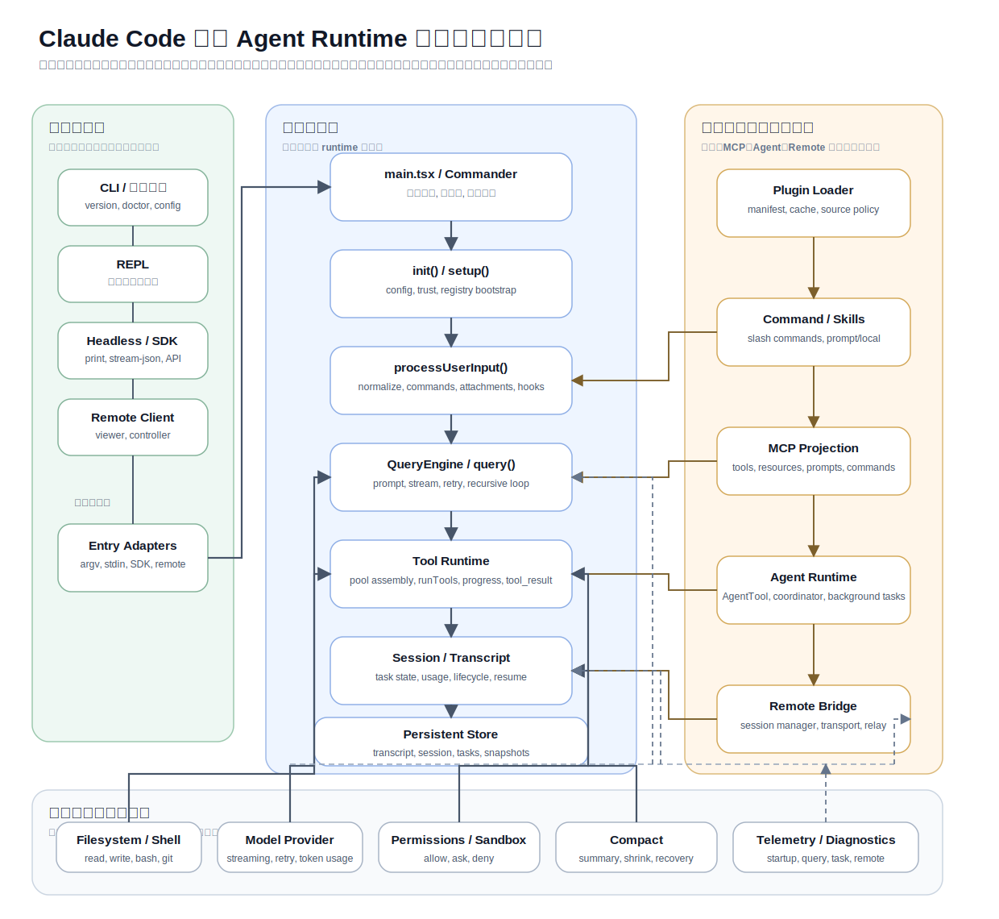
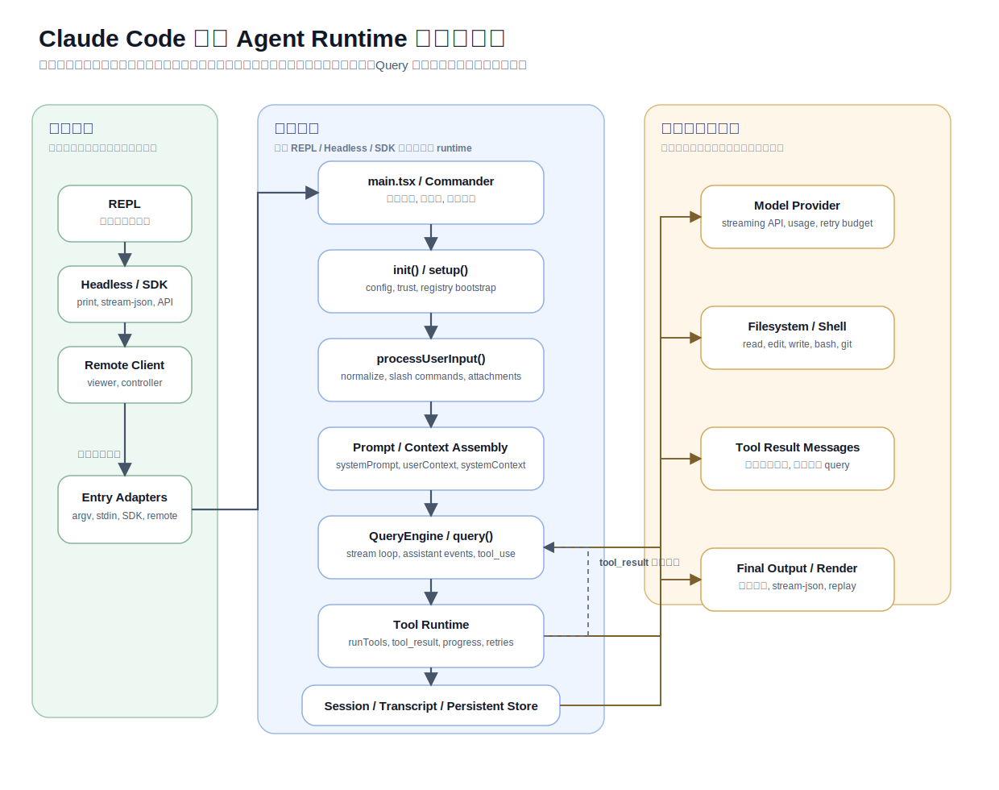
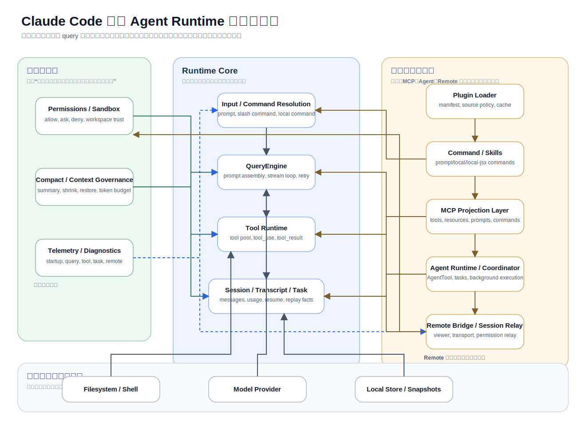
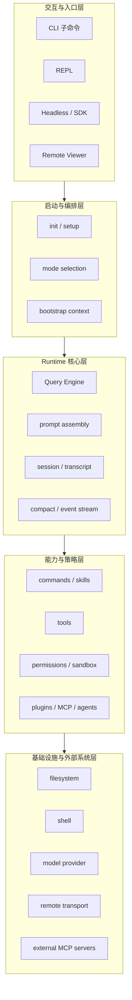

# 第 4 章 系统总览

> 状态: 已完成初稿
> 章节目标: 给出全局架构图，让后面每章都有锚点。

[返回总览](/Users/magongli/Downloads/project/claude-code-sourcemap/docs/plans/2026-03-31-claude-code-runtime-reproduction/README.md)

---

本章给出整个系统的总地图。后面所有章节都会把自己挂在这张图上，因此这里的目标不是把细节讲完，而是把层次、边界、主链路和信任关系全部标出来。

## 4.1 系统整体架构图

建议把系统理解成一个五层结构。

先看总装图，再看下面的五层职责图。  
这张 `SVG` 总装图强调的不是“层次”本身，而是：

- 主执行骨干在哪里
- 扩展能力挂在哪
- 横切治理平面如何覆盖主链路



如果直接看总装图还是嫌密，可以先拆成两张更适合“吃透逻辑”的视图：

- 第一张只看执行主链，回答“一轮请求怎么跑完”
- 第二张只看控制平面，回答“谁在约束、扩展、观测主链”

### 4.1.1 执行主链图



这张图专门压缩成“单轮执行闭环”，你应该按下面的顺序去看：

1. 入口来源如何先收敛到 `Entry Adapters`
2. `main.tsx / Commander` 和 `init()/setup()` 如何把运行环境准备好
3. `processUserInput()` 如何把原始输入变成 runtime 能理解的输入单元
4. `Prompt / Context Assembly` 如何把 system prompt、上下文和会话事实拼进请求
5. `QueryEngine / query()` 如何进入流式循环
6. `Tool Runtime` 如何执行工具并把 `tool_result` 回写给 query
7. `Session / Transcript / Persistent Store` 如何把这一轮变成可恢复、可 replay 的事实

### 4.1.2 控制平面图



这张图不是看“先后顺序”，而是看“挂载关系”。你应该重点抓这几个判断：

- `Permissions / Sandbox` 不属于工具本身，而是工具执行之前的治理层
- `Compact / Context Governance` 不属于 UI，也不属于 prompt 文案，而是运行时核心的上下文调度能力
- `Telemetry / Diagnostics` 不决定行为，但决定你能不能解释行为
- `Command / Skills`、`MCP Projection Layer`、`Agent Runtime`、`Remote Bridge` 都不是主链本体，而是沿着明确挂载点接入核心
- `Filesystem / Shell`、`Model Provider`、`Local Store / Snapshots` 是支撑执行的基础设施，不应反客为主变成主链入口



```text
+--------------------------------------------------------------+
| 交互与入口层                                                 |
| CLI 子命令 | REPL | Headless/SDK | Remote Viewer | Hooks     |
+--------------------------------------------------------------+
| 启动与编排层                                                 |
| init/setup | config loading | mode selection | app bootstrap |
+--------------------------------------------------------------+
| Runtime 核心层                                               |
| QueryEngine | prompt assembly | transcript | session state   |
| compact | event stream | budget/usage | task coordination    |
+--------------------------------------------------------------+
| 能力与策略层                                                 |
| Command registry | Tool registry | permissions | sandbox     |
| skills | plugins | MCP | agent definitions                   |
+--------------------------------------------------------------+
| 基础设施与外部系统层                                         |
| filesystem | shell | network | model provider | local store  |
| remote transport | external MCP servers                      |
+--------------------------------------------------------------+
```

这五层不是部署层，而是职责层。

其中最重要的判断是：

- 交互层负责把用户带进系统。
- 启动层负责把运行环境准备好。
- Runtime 核心层负责一轮 query 的真正闭环。
- 能力与策略层负责“系统能做什么，以及在什么条件下能做”。
- 基础设施层负责与本地和外部世界交互。

如果后续实现中出现职责漂移，比如 REPL 组件直接组装 prompt、工具直接修改全局状态、插件绕过权限层直接执行副作用，都说明已经偏离这张总图。

## 4.2 核心模块地图

为了让这张总图更可落地，可以先定义建议目录结构。

```text
src/
  entrypoints/
    cli/
    repl/
    headless/
    remote/
  bootstrap/
    init/
    setup/
    config/
  runtime/
    query/
    prompt/
    transcript/
    compact/
    events/
    budget/
  state/
    app-state/
    session/
    persistence/
    snapshots/
  commands/
    builtins/
    registry/
    parser/
  tools/
    builtins/
    registry/
    execution/
    schemas/
    context/
  permissions/
    policy/
    classifier/
    sandbox/
  extensions/
    skills/
    plugins/
    mcp/
  agents/
    definitions/
    tasks/
    coordinator/
  remote/
    bridge/
    transport/
    viewer/
  telemetry/
    logging/
    diagnostics/
    replay/
```

这个结构的核心思想不是“目录漂亮”，而是防止几个高频错误：

- 把运行时逻辑散落到 UI 组件里。
- 把扩展系统直接塞进工具目录。
- 把权限实现成工具内部 if/else。
- 把会话持久化写成 REPL 私有逻辑。

各模块职责建议如下。

### 4.2.1 `entrypoints/`

负责外部入口适配，不负责核心业务闭环。它的工作是解析输入、准备环境、调用 runtime、消费输出。

### 4.2.2 `bootstrap/`

负责初始化顺序，例如配置加载、工作目录判断、trust 检查、运行模式选择、日志与诊断启动。

### 4.2.3 `runtime/`

整个系统的心脏。这里放 Query Engine、上下文拼装、compact、事件流、usage 统计等核心逻辑。

### 4.2.4 `state/`

管理 AppState、Session、transcript、snapshot、resume 元数据。它要服务所有入口，而不是某个具体 UI。

### 4.2.5 `commands/`

处理用户显式触发的入口能力，例如 slash command、本地管理命令、prompt command 等。

### 4.2.6 `tools/`

管理模型可调用能力，包括注册、schema、执行上下文、结果回写、工具日志等。

### 4.2.7 `permissions/`

实现统一策略层，对 command、tool、plugin、MCP 的执行资格进行治理。

### 4.2.8 `extensions/`

负责加载 skills、plugins、MCP 等扩展源，但不直接决定它们的执行顺序。扩展装载后应进入命令池、工具池或资源池。

### 4.2.9 `agents/`

提供子 Agent 的定义、运行、任务跟踪与回收机制，使其成为正式运行时能力，而不是“特殊工具函数”。

### 4.2.10 `remote/`

处理远程控制、viewer、bridge 和会话跨端同步。

### 4.2.11 `telemetry/`

提供日志、诊断、回放、分析事件。终端 Agent 的很多问题只有靠运行时事件才能看清。

## 4.3 主要数据流

本系统的主数据流建议定义为：

```text
User Input
  -> Input Normalization
  -> Command Detection / Prompt Construction
  -> Query Context Assembly
  -> System Prompt Composition
  -> Model Request
  -> Assistant Stream Events
  -> Tool Request
  -> Permission Check
  -> Tool Execution
  -> Tool Result Message
  -> Continue Query Loop
  -> Final Assistant Output
  -> Session Persist / UI Render / Replay Log
```

这里有几个关键点。

第一，用户输入不会直接进入模型，而是先经过标准化和入口判断。因为 slash command、attachments、hooks、resume 场景都可能改变输入语义。

第二，模型输出不会直接显示给用户，而是会先被解析成事件流。只有这样，系统才能在中途识别工具调用、权限请求、中断、错误和最终文本输出。

第三，工具执行结果不是临时变量，而是会回写成标准消息，再重新进入 query 循环。这一点非常关键，因为它保证了工具结果成为会话事实的一部分，而不是当前函数栈里的旁路数据。

第四，会话持久化和 UI 渲染都应该消费同一条事件或状态流，而不是各自维护一套“自认为正确”的解释。

## 4.4 主要控制流

数据流描述的是“东西如何流动”，控制流描述的是“系统在什么条件下切换状态”。

本系统至少存在以下几条关键控制流。

### 4.4.1 启动控制流

```text
CLI start
  -> parse args
  -> init
  -> load config / environment
  -> resolve mode
  -> setup session context
  -> launch REPL or run headless or execute command
```

这里的重点是 `init` 和 `setup` 的拆分。前者更偏全局、安全和环境准备；后者更偏会话局部状态和运行上下文。

### 4.4.2 REPL 轮次控制流

```text
user submits input
  -> normalize input
  -> handle slash command or enter query
  -> run QueryEngine
  -> stream assistant events
  -> handle tool loop
  -> update transcript/state
  -> render final output
  -> wait for next turn
```

### 4.4.3 Headless 控制流

```text
receive prompt / task
  -> construct runtime context
  -> run QueryEngine without REPL
  -> emit structured result
  -> persist if requested
  -> exit or return to caller
```

Headless 的重点不是少一个界面，而是多一个“结构化结果出口”。因此 Query Engine 不能假设自己总在和 REPL 组件对话。

### 4.4.4 Compact 控制流

```text
after turn / before turn / on threshold breach
  -> estimate token usage
  -> compare against warning/blocking policy
  -> decide compact strategy
  -> produce summary / preserved context
  -> rewrite or augment runtime context
  -> continue session
```

Compact 是横切控制流，它可能发生在 query 之前、之后或中间恢复阶段，所以不应该挂在某个具体命令上。

### 4.4.5 Agent/Task 控制流

```text
parent session decides to delegate
  -> create task record
  -> spawn agent context
  -> run child query loop
  -> stream or buffer results
  -> merge summary/output back to parent
  -> close or retain task state
```

这条控制流在后期章节会详细展开。这里先强调：它和普通工具执行相似，但不是一回事，因为它有独立生命周期和状态空间。

## 4.5 运行边界与信任边界

系统总览里最不能省略的一张图，就是信任边界图。

```text
Trusted Core
  - runtime core
  - state store
  - permission engine
  - built-in command/tool registry

Conditionally Trusted
  - current workspace
  - session transcripts
  - local skills
  - approved plugins

Untrusted / Semi-trusted
  - user prompt content
  - repository files
  - MCP server responses
  - shell output
  - network resources
  - remote peers
```

这个划分会直接影响架构设计。

### 4.5.1 为什么工作区不是天然可信的

很多终端工具默认“你本地仓库当然可信”，但这在真实场景里并不成立。仓库里可能包含：

- 恶意 prompt injection 文本。
- 误导性的 README 或脚本。
- 会诱导模型执行危险命令的内容。

因此，workspace trust 不能默认等于“本地磁盘内容可信”，而应该成为明确的权限上下文。

### 4.5.2 为什么 MCP 和插件不能绕过权限层

MCP server 和插件虽然扩展了系统能力，但它们本身也带来了新的攻击面和失控面。如果让它们直接拥有执行能力，就会破坏整个系统的安全一致性。

因此，原则上：

- 扩展可以贡献能力。
- 但最终执行资格仍由统一权限层裁定。

### 4.5.3 为什么 transcript 既是资产也是风险

transcript 是系统最重要的长期记忆之一，但同时也会携带历史误导、注入内容、错误策略、过期上下文。因此它既要被保留，也要被治理。compact、summary、replay 都建立在这个判断之上。

## 4.6 系统的主设计判断

基于总览图，本项目可以用一句更聚焦的话来概括：

> 这个系统的真正内核不是 REPL，也不是某个工具集合，而是一个能够在权限边界内，持续管理消息、上下文、工具调用和状态演化的 Query Runtime。

只要这句话成立，后续不论是：

- 加一个新 command
- 接一个新 MCP server
- 做一个 background agent
- 增加一个 remote viewer

都应该是在这颗内核之外叠层，而不是把内核重新打碎重做。

## 4.7 本章结论

第 4 章要固定下来的核心事实有四个：

- 系统是分层的，不能让 UI 或扩展面主导内核。
- 主链路是 `输入 -> query -> tool -> result -> transcript -> 持久化/渲染`。
- 权限与信任边界必须在系统总图里出现，而不是后补。
- 后续所有章节，都必须回答“自己在这张总图中的位置是什么”。

## 4.8 本章对复现工程的直接指导

总览这一章在实现时最应该落成“目录与模块边界图”。

### 4.8.1 推荐目录映射

```text
src/
  bootstrap/
  query/
  context/
  tools/
  commands/
  permissions/
  session/
  compact/
  mcp/
  plugins/
  agents/
  remote/
  telemetry/
  ui/
```

### 4.8.2 每层只承担自己的事

- `ui/` 不做 query 编排
- `plugins/` 不直接改全局状态
- `mcp/` 不直接控制 transcript
- `agents/` 不直接吞掉 tool registry

### 4.8.3 复现时最重要的总图检查

每次加模块都要回答：

- 它属于哪一层
- 它依赖上层还是下层
- 它是否越过了权限/状态边界

### 4.8.4 真正该复用的是总图

这一章最值得你拿去直接照着搭的，不是某张概念图，而是“分层后谁不能越界”的原则。
