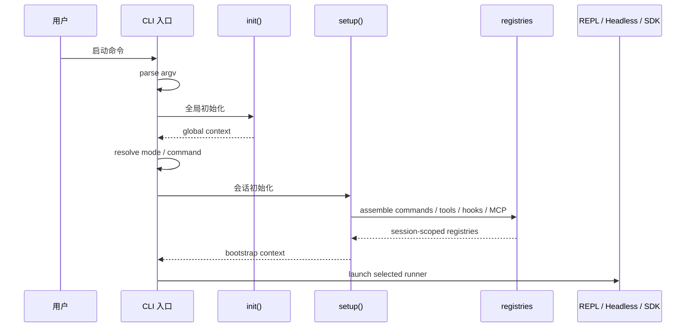

# 第 6 章 启动与初始化设计

> 状态: 已完成初稿
> 章节目标: 明确从命令行启动到进入会话的全链路。

[返回总览](/Users/magongli/Downloads/project/claude-code-sourcemap/docs/plans/2026-03-31-claude-code-runtime-reproduction/README.md)

---

本章关注的是系统从“用户敲下命令”到“进入稳定运行状态”之间的全过程。对于终端 Agent Runtime 来说，启动阶段往往比看上去更重要，因为：

- 很多安全边界发生在真正进入会话之前。
- 很多性能问题发生在无意义的早期加载中。
- 很多模式分叉就从入口编排开始。

所以启动设计的目标不是“能跑起来”，而是“安全、可预测、可复用地跑起来”。

## 6.1 启动设计目标

启动流程至少要同时满足以下目标：

- 快速启动，避免每次打开终端都做大量无关加载。
- 明确区分全局初始化与会话初始化。
- 在 trust 未建立之前，避免装载高风险本地扩展和工作区内容。
- 让模式分发在一个地方完成，而不是散落到多个入口文件。
- 为日志、诊断、profile、异常处理留出统一接入点。

## 6.2 CLI 入口与参数解析

建议整个工程只有一个真正的主入口，例如 `main.tsx` 或 `cli.ts`。这个入口只负责四类事情：

- 解析 CLI 参数和子命令。
- 做最小必要的启动前准备。
- 分发到正确运行模式。
- 为后续模式创建统一 bootstrap context。

主入口不应该承担以下职责：

- 直接实现 Query Engine。
- 直接定义工具列表。
- 直接组装系统提示词。
- 直接管理会话状态。

如果入口文件过重，通常意味着整个工程正在丧失层次感。

### 6.2.1 参数解析建议

CLI 参数建议按功能分成三类：

- 模式选择参数：例如 `--print`、`--headless`、`--resume`、`--remote`。
- 运行时覆盖参数：例如模型、工作目录、权限模式、compact 策略。
- 控制平面参数：例如 `config`、`doctor`、`version`、`mcp`、`plugin`。

这样可以在解析阶段就初步决定：

- 是否需要真正进入 runtime。
- 是否需要恢复旧 session。
- 是否允许加载工作区相关内容。

## 6.3 启动编排器设计

建议引入一个启动编排器概念，把入口和模式真正隔开。它的职责是：

- 把 CLI 输入变成标准化的启动请求。
- 运行 `init()`。
- 运行 `setup()`。
- 决定最终进入 REPL、headless、control-plane command 还是 remote client。

一个推荐的启动时序如下：



```text
process start
  -> parse argv
  -> create bootstrap context
  -> init(global)
  -> resolve command/mode
  -> setup(session-scoped)
  -> launch selected runner
```

## 6.4 `init` 与 `setup` 的职责划分

`init` 和 `setup` 的划分是整个启动设计最关键的边界之一。

### 6.4.1 `init()` 的职责

`init()` 处理全局性、模式无关、风险较低、对后续所有模式都必要的准备工作，例如：

- 读取环境变量。
- 建立基础日志与诊断能力。
- 解析全局配置目录。
- 检查运行平台、Node 版本、必要依赖。
- 初始化基础 provider registry。
- 进行最小化的身份与认证状态读取。

`init()` 不应该做的事包括：

- 读取当前仓库里的高信任内容。
- 装载工作区 skill/plugin。
- 恢复具体某个 session。
- 创建会话级状态。

### 6.4.2 `setup()` 的职责

`setup()` 处理会话相关、模式相关、上下文相关的工作，例如：

- 解析工作目录和项目根。
- 建立 workspace trust 上下文。
- 恢复或创建 Session。
- 装配命令池与工具池。
- 根据模式决定输出适配器和权限交互器。
- 加载 session-scoped 的 hooks、skill、MCP、plugin。

可以把二者理解为：

- `init()` 负责“让程序能安全开始”。
- `setup()` 负责“让这次会话进入可执行状态”。

## 6.5 配置加载时序

终端 Agent Runtime 的配置源通常很多，因此必须定义清晰优先级。建议的加载顺序如下。

### 6.5.1 配置来源

- 内置默认值。
- 全局用户配置文件。
- 环境变量。
- 工作区配置文件。
- session 恢复元数据。
- CLI 参数覆盖。
- 模式级临时覆盖。

### 6.5.2 推荐优先级

建议优先级从低到高如下：

```text
defaults
  < global config
  < env vars
  < workspace config
  < resumed session metadata
  < cli flags
  < mode-specific overrides
```

这里要特别注意两点。

第一，工作区配置应在 trust 判断后再生效，至少对会影响执行能力的部分应如此。否则相当于未审查的仓库内容可以影响本地 Agent 行为。

第二，session 恢复元数据不能无条件覆盖 CLI 参数。用户显式传入的本轮参数应拥有更高优先级。

## 6.6 trust 前与 trust 后的安全边界

启动阶段最容易被忽视的问题，就是哪些事情可以在 trust 建立之前做，哪些必须等 trust 建立之后再做。

### 6.6.1 trust 前允许的动作

- 读取全局配置。
- 读取环境变量。
- 识别当前目录和仓库边界。
- 读取内置命令与内置工具定义。
- 启动基本日志和诊断。
- 进行只读、非执行型的环境探测。

### 6.6.2 trust 后才允许的动作

- 加载工作区级 skills、plugins、hooks。
- 采纳工作区级 prompt 片段或配置覆盖。
- 恢复依赖仓库内容的 session 上下文。
- 启用会影响工具执行的本地策略扩展。

### 6.6.3 设计原则

原则上，任何来自当前工作区、且可能影响执行行为的内容，都不应在 trust 建立前直接进入 runtime。

这样做有两个好处：

- 降低 prompt injection 和本地配置劫持风险。
- 让“信任工作区”成为真正有意义的状态，而不是一个摆设。

## 6.7 模式选择与启动分发

当 `init()` 和基础配置完成后，启动编排器就要选择最终模式。建议分发逻辑如下：

```text
if control-plane command:
  run command runner
else if remote viewer/client:
  run remote runner
else:
  run setup()
  if repl:
    launch REPL
  else if headless:
    run headless session
```

这里的重点是：不要让每个子命令自己偷偷做一遍 setup，也不要让 REPL 和 headless 各自组装一遍 runtime。

## 6.8 懒加载与启动性能策略

终端工具的使用频率很高，启动性能会直接影响体验。建议采用以下懒加载策略。

### 6.8.1 启动时只加载必需能力

必需能力包括：

- 参数解析。
- 基础配置。
- 日志与错误处理。
- 模式判断。

以下内容应尽量延后：

- 大型 prompt 模板。
- 不一定会用到的命令实现。
- plugin/MCP 的深度装载。
- 重量级 UI 组件。
- Agent、remote、viewer 等高级模块。

### 6.8.2 按模式加载

- REPL 相关 UI 组件只在 REPL 模式导入。
- Headless 输出序列化只在 headless 模式导入。
- Remote transport 只在 remote 模式导入。

### 6.8.3 按使用路径加载

例如 command registry 可以先只注册元信息，等用户触发命令时再懒加载执行体；MCP server 可以先完成发现和元数据读取，等真正暴露工具时再建立连接。

## 6.9 启动失败与恢复策略

启动设计不能只考虑 happy path，还必须覆盖失败路径。

常见启动失败包括：

- 配置格式错误。
- 工作目录不可访问。
- 认证状态损坏。
- session 恢复数据不兼容。
- MCP/plugin 初始化失败。
- trust 状态缺失或冲突。

建议策略如下：

- 全局配置错误应尽早报错并附带修复建议。
- 工作区相关错误不应破坏 control-plane commands。
- 单个 plugin/MCP 失败应尽量降级，而不是直接拖垮整个 runtime。
- session 恢复失败时允许用户回退到新会话。

## 6.10 本章结论

启动与初始化设计的核心，不是“程序怎么启动”，而是：

- 哪些事情必须只做一次。
- 哪些事情属于具体会话。
- 哪些事情在 trust 前绝不能做。
- 哪些能力可以延后加载以保证启动快。

只要这几条边界清楚，整个系统的入口复杂度就会大幅下降。

## 6.11 本章对复现工程的直接指导

建议你把启动流程直接固化成下面这种骨架：

```ts
main()
  -> parseCliArgs()
  -> initGlobalRuntime()
  -> loadConfigAndPolicy()
  -> resolveMode()
  -> createSessionBootstrapContext()
  -> assembleRegistries()
  -> startReplOrHeadlessOrSdk()
```

### 6.11.1 先区分全局初始化和会话初始化

- 全局初始化: logger、analytics sink、基础配置、feature flags
- 会话初始化: cwd、sessionId、transcript、registry、mode-specific adapters

### 6.11.2 把 trust 前后的行为切开

在 trust 之前，建议不要自动加载：

- 项目级 plugin
- 工作区 hooks
- 受限本地 customization

### 6.11.3 懒加载从一开始就做

像 MCP/plugin/remote 这种重能力，建议都通过显式装配触发，而不是顶层 import 全部拉进来。

### 6.11.4 启动阶段必须可 profile

startup profiler、diagnostics、错误分类入口最好第一版就插好，不然后面会很难追慢点。
