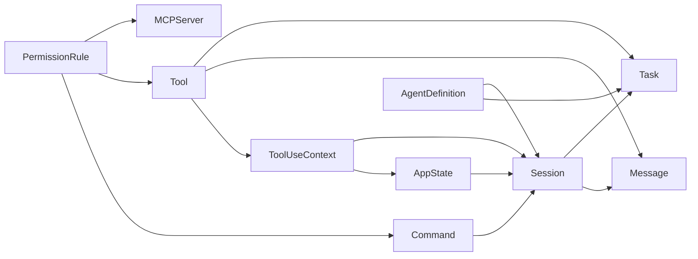

# 第 7 章 核心领域模型

> 状态: 已完成初稿
> 章节目标: 把后续所有实现都建立在稳定的类型和概念上。

[返回总览](/Users/magongli/Downloads/project/claude-code-sourcemap/docs/plans/2026-03-31-claude-code-runtime-reproduction/README.md)

---

本章的目标，是把整个 Agent Runtime 的核心对象体系定义清楚。没有稳定的领域模型，系统后面所有能力都会漂浮不定。尤其是在终端 Agent 这种多入口、多状态、多扩展、多副作用的系统里，核心类型其实比 UI 更重要。

本章不会追求把每个字段一次性定义到最终形态，但会先把必须稳定的接口边界钉住。

## 7.1 建模原则

核心领域模型设计遵循以下原则：

- 模型先服务运行时闭环，再服务外部展示。
- 可进入 transcript 的数据，必须有明确编码方式。
- 可产生副作用的能力，必须有正式上下文对象。
- UI 状态与会话事实必须分离。
- 扩展能力接入时，应落入既有模型，而不是临时造旁路结构。

## 7.2 `Message`

`Message` 是整个系统最核心的对象之一，因为它是 transcript、replay、compact、resume、调试和远程同步的共同基础。

建议定义一个统一消息基类：

```ts
type MessageRole =
  | "system"
  | "user"
  | "assistant"
  | "tool"
  | "summary"
  | "event";

type MessageKind =
  | "text"
  | "tool_use"
  | "tool_result"
  | "command_result"
  | "status"
  | "summary"
  | "attachment";

interface Message {
  id: string;
  sessionId: string;
  turnId: string;
  role: MessageRole;
  kind: MessageKind;
  createdAt: string;
  content: unknown;
  metadata?: Record<string, unknown>;
}
```

这个定义的核心思想不是字段有多少，而是以下三个原则：

- transcript 中所有关键事实都尽量落成标准消息。
- 工具调用和工具结果必须能够被标准化记录。
- 摘要、恢复信息、系统注释等也应该有正式类型，而不是散落在各处的字符串。

### 7.2.1 为什么要区分 `role` 与 `kind`

`role` 代表消息在对话语义中的位置，`kind` 代表消息的技术形态。二者分开可以避免很多混淆，例如：

- assistant 也可能产生 `tool_use` 类型消息。
- tool 角色通常对应 `tool_result`。
- system 或 summary 也可能以结构化内容存在。

### 7.2.2 `Message` 的不变量

- 每条消息必须归属于某个 session。
- 每条消息应尽量归属于某个 turn。
- transcript 中的顺序必须可重建。
- 所有进入模型上下文的消息，必须可序列化。

## 7.3 `Command`

`Command` 是用户入口能力，不是模型能力。它的职责是把“用户显式要做的操作”组织成可注册、可发现、可执行的单元。

建议接口如下：

```ts
type CommandType = "prompt" | "local" | "local-jsx";

interface Command {
  name: string;
  type: CommandType;
  description: string;
  aliases?: string[];
  isEnabled?(ctx: CommandContext): boolean | Promise<boolean>;
  isRemoteSafe?: boolean;
  requiresWorkspaceTrust?: boolean;
  run(ctx: CommandContext): Promise<CommandResult>;
}
```

### 7.3.1 三类命令的职责

- `prompt`: 本质上是 prompt 模板或 prompt 入口，最终会进入 Query Engine。
- `local`: 本地执行逻辑，通常不需要模型参与。
- `local-jsx`: 带交互 UI 或终端组件渲染的本地命令。

### 7.3.2 `Command` 的边界

命令可以调用 runtime，但不应该绕过 runtime 直接破坏会话事实。例如，一个 `/compact` 命令可以触发 compact 流程，但 compact 后的 transcript 更新仍应通过正式 session API 完成。

## 7.4 `Tool`

`Tool` 是暴露给模型调用的受控能力单元。工具的定义必须足够正式，因为它涉及：

- 能力暴露。
- schema 校验。
- 权限审查。
- 执行上下文。
- 结果回写。
- 调试与回放。

建议接口如下：

```ts
interface Tool<Input = unknown, Output = unknown> {
  name: string;
  description: string;
  inputSchema: unknown;
  isReadOnly?: boolean;
  requiresApproval?: boolean;
  isEnabled?(ctx: ToolExposureContext): boolean | Promise<boolean>;
  invoke(
    input: Input,
    ctx: ToolUseContext
  ): Promise<ToolExecutionResult<Output>>;
}
```

### 7.4.1 `Tool` 与 `Command` 的根本区别

- `Command` 由用户显式触发。
- `Tool` 由模型在推理过程中调用。

这个区别直接决定了：

- `Tool` 必须具备更严格的 schema 和权限控制。
- `Command` 更强调入口体验和发现性。

### 7.4.2 `Tool` 的返回值

建议工具不要只返回一段文本，而是返回结构化结果：

```ts
interface ToolExecutionResult<T = unknown> {
  output: T;
  displayText?: string;
  metadata?: Record<string, unknown>;
  artifacts?: Array<{ type: string; uri?: string; data?: unknown }>;
}
```

这样既能满足模型继续推理，也能满足 UI 展示和 replay。

## 7.5 `ToolUseContext`

`ToolUseContext` 是连接“运行时”与“工具执行”的桥梁。它的目的，是阻止工具直接依赖全局单例或隐式环境。

建议接口如下：

```ts
interface ToolUseContext {
  session: Session;
  appState: AppState;
  cwd: string;
  abortSignal: AbortSignal;
  permissions: PermissionEvaluator;
  logger: Logger;
  emitEvent(event: RuntimeEvent): void;
  appendMessage(message: Message): Promise<void>;
  resolvePath(path: string): string;
}
```

### 7.5.1 为什么 `ToolUseContext` 重要

如果工具可以自由读取全局变量、直接操作磁盘、自己决定如何写回 transcript，那么：

- 工具不可测试。
- 权限不可统一。
- replay 不可重建。
- SDK/remote 模式无法稳定复用。

所以 `ToolUseContext` 是必须稳定的中枢接口之一。

## 7.6 `AppState`

`AppState` 代表运行时当前视角下的全局状态快照，但它不等于“所有东西都堆在一个对象里”。建议它是一个由多个 slice 组成的根状态：

```ts
interface AppState {
  session: SessionState;
  ui: UIState;
  runtime: RuntimeState;
  permissions: PermissionState;
  tools: ToolState;
  tasks: TaskState;
  telemetry: TelemetryState;
}
```

这里最重要的原则是：

- `session` 和 `runtime` 是事实状态。
- `ui` 是表现状态。
- `permissions`、`tools`、`tasks` 是横切状态。

## 7.7 `Session`

`Session` 代表一次持续交互的完整容器。建议定义如下：

```ts
interface Session {
  id: string;
  createdAt: string;
  updatedAt: string;
  cwd: string;
  mode: "repl" | "headless" | "sdk" | "remote";
  transcript: Message[];
  summary?: SessionSummary;
  configSnapshot: SessionConfigSnapshot;
  metadata: Record<string, unknown>;
}
```

`Session` 需要解决的不是“保存聊天记录”这么简单，而是：

- 让一次协作具备稳定身份。
- 让 compact 和 resume 有依托。
- 让权限、任务、工作目录、配置快照有归属。

## 7.8 `Task`

当系统引入后台任务、子 Agent、长命令执行、远程协作时，单靠 session 已经不够，需要 `Task` 来表示一个具有独立生命周期的工作单元。

```ts
type TaskStatus =
  | "pending"
  | "running"
  | "waiting_input"
  | "completed"
  | "failed"
  | "cancelled";

interface Task {
  id: string;
  sessionId: string;
  kind: "tool" | "agent" | "command" | "remote";
  status: TaskStatus;
  title: string;
  createdAt: string;
  updatedAt: string;
  parentTaskId?: string;
  result?: unknown;
  error?: SerializedError;
}
```

`Task` 让系统可以：

- 跟踪后台 agent。
- 在 UI 中显示进行中的工作。
- 对长执行工具做中断和恢复。
- 在 remote 模式中同步工作状态。

## 7.9 `AgentDefinition`

`AgentDefinition` 是“某类子 Agent 的可执行描述”，而不是一次具体运行。

```ts
interface AgentDefinition {
  name: string;
  description: string;
  prompt: string;
  tools: string[];
  model?: string;
  permissionProfile?: string;
  executionMode?: "sync" | "background";
}
```

其关键价值在于：

- 能力可裁切。
- prompt 可专门化。
- 子 Agent 可以标准化生成，而不是在主逻辑里拼 prompt。

## 7.10 `PermissionRule`

权限模型必须可序列化、可解释、可组合。建议至少包含：

```ts
type PermissionDecision = "allow" | "deny" | "ask";

interface PermissionRule {
  id: string;
  scope: "tool" | "command" | "path" | "network" | "plugin" | "mcp";
  matcher: Record<string, unknown>;
  decision: PermissionDecision;
  reason?: string;
  source: "default" | "user" | "workspace" | "session" | "policy";
}
```

这样做的好处是：

- 权限来源可追踪。
- ask/allow/deny 的覆盖关系可解释。
- headless/SDK/remote 可以复用同一规则系统。

## 7.11 `MCPServer`

MCP 不应只是“一段连接配置”，而应是正式注册对象。

```ts
interface MCPServer {
  id: string;
  name: string;
  transport: "stdio" | "http" | "sse" | "ws";
  status: "disconnected" | "connecting" | "ready" | "error";
  capabilities: {
    tools?: boolean;
    resources?: boolean;
    prompts?: boolean;
    commands?: boolean;
  };
  config: Record<string, unknown>;
}
```

这个模型让我们后续可以清晰表达：

- 哪个 server 当前已连接。
- 它贡献了哪些能力。
- 它是否在当前模式可用。
- 它的失败是否应该影响整个 runtime。

## 7.12 模型之间的关系

这些核心模型之间的关系建议如下：

```text
Session
  -> owns Message[]
  -> owns Task[]
  -> references config snapshot

AppState
  -> points to current Session
  -> tracks runtime/ui/permission/tool slices

Command
  -> entered by user
  -> may create Query or mutate Session through APIs

Tool
  -> exposed to model
  -> executes with ToolUseContext
  -> writes Message / Task / events back

AgentDefinition
  -> used to create Task + child Session/Query

PermissionRule
  -> filters Command / Tool / MCP / Plugin behavior
```

如果这个关系图不稳定，后续 compact、MCP、agent、remote 都会出现职责冲突。



## 7.13 本章结论

第 7 章真正要固定下来的，不是字段细节，而是这些判断：

- `Message` 是会话事实的基本单位。
- `Command` 和 `Tool` 必须明确分离。
- `ToolUseContext` 是受控执行的关键桥梁。
- `Session`、`Task`、`AppState` 共同构成长期运行骨架。
- `PermissionRule` 和 `AgentDefinition` 必须是正式一等对象。

## 7.14 本章对复现工程的直接指导

如果只允许你在第一周冻结少数接口，那就先冻结下面这些：

```ts
type Message
type Command
type Tool
type ToolUseContext
type Session
type Task
type AppState
type PermissionRule
type AgentDefinition
```

### 7.14.1 为什么先冻结这些

因为后面几乎所有能力都会依赖它们：

- compact 依赖 `Message/Session`
- tools 依赖 `Tool/ToolUseContext`
- REPL 依赖 `AppState`
- multi-agent 依赖 `Task/AgentDefinition`

### 7.14.2 冻结的不是字段总量，而是职责边界

你可以后续加字段，但不要轻易改变：

- `Message` 是否可持久化
- `Command` 和 `Tool` 是否混用
- `ToolUseContext` 是否包含权限/状态桥接

这章的真正落地价值，就是帮你避免类型边界反复推倒重来。
