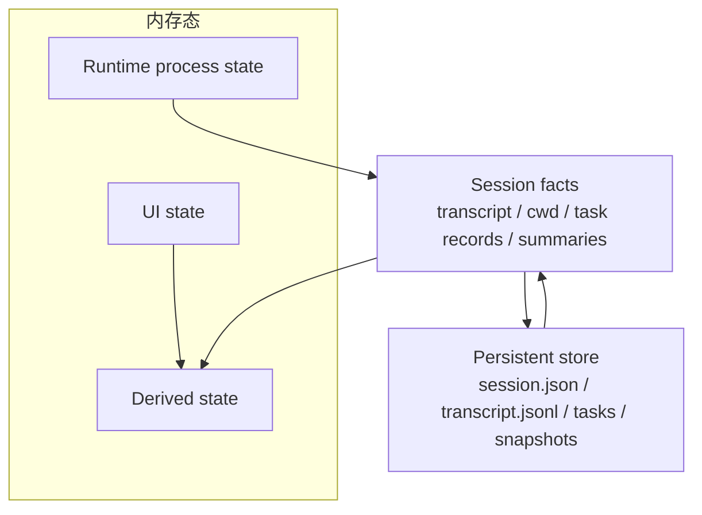

# 第 8 章 会话与状态管理设计

> 状态: 已完成初稿
> 章节目标: 让系统具备长期运行能力，而不是一次性脚本式调用。

[返回总览](/Users/magongli/Downloads/project/claude-code-sourcemap/docs/plans/2026-03-31-claude-code-runtime-reproduction/README.md)

---

如果说上一章定义的是“系统里有哪些关键对象”，那本章定义的就是“这些对象如何在长时间运行中保持一致”。终端 Agent Runtime 最容易被低估的部分就是状态管理，因为早期 demo 往往只需要一个消息数组，但真实使用很快就会碰到：

- 长会话 transcript 爆炸。
- 工具执行中断。
- 多个并发任务。
- UI 状态和会话事实混在一起。
- 恢复旧会话时上下文错位。

所以本章的目标，是把状态系统从“临时内存变量”提升成正式设计。

## 8.1 状态分层原则

建议整个系统至少分成四层状态。



### 8.1.1 会话事实状态

这类状态构成系统长期记忆，应该可以持久化和恢复，例如：

- transcript
- compact summary
- cwd
- session config snapshot
- task records
- 权限决策历史

### 8.1.2 运行时过程状态

这类状态反映当前执行过程，不一定需要长期持久化，例如：

- 当前 query 是否正在运行
- 正在流式输出的 assistant 内容
- 当前工具调用栈
- abort / interrupt 标记
- 当前 token 估算结果

### 8.1.3 UI 表现状态

这类状态只服务渲染，例如：

- 输入框内容
- 当前焦点
- 展开的面板
- REPL 视图滚动位置
- 权限弹窗是否打开

### 8.1.4 派生状态

这类状态可以从其他状态计算得到，不应作为独立事实源，例如：

- 当前 turn 的消息列表
- 某个文件最近一次修改结果
- session 是否接近 token 上限
- 当前是否存在可恢复任务

这个分层的意义在于：不是所有“看起来有用的数据”都应该持久化，也不是所有状态都应该放进 AppState 根对象里。

## 8.2 AppState 结构设计

建议 `AppState` 采用分 slice 设计，而不是单一大对象无序增长。

```ts
interface AppState {
  session: SessionState;
  runtime: RuntimeState;
  ui: UIState;
  permissions: PermissionState;
  tasks: TaskState;
  integrations: IntegrationState;
}
```

可以进一步理解为：

- `session`: 当前会话的持久事实。
- `runtime`: 当前执行中的短生命周期状态。
- `ui`: REPL 或 viewer 的表现层状态。
- `permissions`: 当前 ask/allow/deny 相关状态与历史。
- `tasks`: 后台 agent、长工具执行、命令任务。
- `integrations`: MCP/plugin/remote 连接状态。

### 8.2.1 为什么不用“只有一个 Session 对象”

因为运行时中存在大量不属于 session 长期事实的数据。例如某次流式响应已经输出到第几个 chunk、当前工具是否等待人工批准、某个 viewer 是否在线，这些都不应直接塞进 `Session` 本体。

## 8.3 消息历史与 transcript 设计

transcript 是系统最核心的持久状态之一。建议遵循以下原则。

### 8.3.1 transcript 是事实日志，不是 UI 缓存

它应该记录：

- 用户输入。
- assistant 输出。
- 工具调用与工具结果。
- compact 产生的 summary。
- 关键系统事件。

它不应该记录：

- 每个流式 token 的临时拼接过程。
- REPL 纯展示状态。
- 仅用于本次渲染的局部标志。

### 8.3.2 transcript 的两种视图

建议同时支持：

- `raw transcript`: 完整消息序列，用于恢复、回放、诊断。
- `effective transcript`: 经过 compact 和过滤后，实际进入模型上下文的消息视图。

如果没有这两个视图，compact 往往会把“历史事实”和“当前上下文窗口”混成一件事。

### 8.3.3 turn 分组

建议消息在存储层保留 turn 归属。这样可以支持：

- 按轮次回放。
- 按轮次 compact。
- 分析某轮 query 的完整成本和工具调用。

## 8.4 文件状态缓存

终端 Agent 的一个独特问题，是它不仅要管理对话，还要管理“工作区变化感知”。因此建议引入文件状态缓存层。

### 8.4.1 缓存目标

- 跟踪工具最近读写过哪些文件。
- 记录文件哈希、mtime 或内容快照摘要。
- 帮助系统判断某个文件是否在本轮外被修改。
- 为 diff 展示、compact 和恢复提供辅助信息。

### 8.4.2 为什么需要文件缓存

如果没有文件缓存，系统很难回答：

- 用户修改过的文件是否被外部进程改写。
- 某次 edit 工具返回后，文件是否处于预期状态。
- compact 后哪些文件事实需要保留给模型。

这层缓存不必一开始就很重，但至少要把“当前会话感知到的文件状态”纳入正式模型。

## 8.5 file history 与 snapshot

仅有当前文件缓存还不够，系统还需要某种轻量历史能力。

### 8.5.1 file history

file history 关注的是：

- 某个文件在会话内被哪些工具修改过。
- 每次修改发生在哪个 turn。
- 修改前后摘要是什么。

### 8.5.2 snapshot

snapshot 更关注一个时间点上的整体会话状态，例如：

- transcript 截面
- 关键文件状态摘要
- 当前权限模式
- 未完成 task 列表
- compact summary

snapshot 的价值在于：

- 恢复失败时有回退点。
- rewind 时有锚点。
- 远程同步时可减少全量重传。

## 8.6 session persistence

会话持久化建议从简单方案起步，但必须设计清楚。

### 8.6.1 持久化内容

第一版建议持久化：

- session metadata
- transcript
- compact summary
- config snapshot
- task metadata
- permission history

可选持久化：

- 文件状态缓存
- replay 事件流
- 远程同步游标

### 8.6.2 存储形式

MVP 阶段推荐：

- `session.json` 保存元数据
- `transcript.jsonl` 保存消息流
- `tasks.json` 保存任务状态
- `summary.json` 保存 compact 结果

这样做的好处是简单、可调试、可人工检查。

### 8.6.3 写入策略

建议采用“增量追加 + 关键点快照”的混合方式：

- transcript 追加写入。
- summary 和 metadata 覆盖更新。
- 大状态变更后触发快照。

这样可以减少单文件重写成本，也更适合 replay。

## 8.7 resume / fork / rewind 机制

这三个能力很容易被混淆，但职责不同。

### 8.7.1 `resume`

在同一 session 上继续工作。其核心要求是：

- transcript 连续。
- compact summary 连续。
- task 状态可恢复或可解释。
- cwd 与 config snapshot 有明确继承规则。

### 8.7.2 `fork`

从某个 session 或某个 turn 分叉出新会话。其核心价值是允许用户：

- 保留原始思路。
- 试验另一条执行路径。
- 在不污染主线 transcript 的情况下探索方案。

fork 通常应继承：

- transcript 某个截面。
- compact summary。
- 部分配置快照。

但不一定继承：

- 进行中的任务。
- UI 状态。
- 某些一次性权限批准。

### 8.7.3 `rewind`

rewind 不是 resume，也不是 fork。它表示：

- 会话仍然是同一个 identity。
- 但上下文视角回退到某个更早节点。

rewind 的难点在于：

- 已发生的文件副作用不一定可逆。
- transcript 需要保留历史还是截断，需要明确策略。

因此设计上建议：

- 初期优先支持逻辑 rewind，而不是自动回滚文件系统。
- rewind 后通过系统消息明确标记“当前有效上下文基于哪个快照/turn”。

## 8.8 状态变更传播机制

一旦系统进入流式输出、工具回写、后台任务、多端观察场景，状态更新就不能靠“谁需要谁就直接读写”。

建议采用以下机制：

### 8.8.1 单向更新原则

- 核心运行时通过明确 API 更新状态。
- UI 只订阅状态，不直接篡改会话事实。
- 工具通过 `ToolUseContext` 间接写入状态。

### 8.8.2 事件与状态分离

建议同时存在：

- `state store`: 当前事实快照。
- `event stream`: 变化过程和过程性信号。

例如：

- “当前 assistant 正在输出第 10 个 chunk”更像事件。
- “当前 session 的 transcript 已追加一条 assistant 消息”是状态更新。

两者分离后，REPL、SDK、remote、replay 都会更清晰。

### 8.8.3 订阅粒度

建议按 slice 订阅，而不是每次整个 AppState 全量刷新。否则 REPL 和 remote viewer 都容易在长会话中出现性能问题。

## 8.9 并发与一致性约束

即使第一版不做复杂并发，也必须先定义一致性约束。

建议至少满足：

- 同一 session 同时只有一个前台 query 在推进。
- 背景 task 与前台 query 通过任务系统隔离。
- transcript 追加必须有顺序保障。
- compact 期间禁止并发修改 transcript 主体。
- session 持久化写入必须避免部分成功、部分失败。

如果这些约束不先说清楚，后续一旦引入 agent 或 remote，状态系统会非常脆弱。

## 8.10 错误路径与恢复设计

状态系统必须为错误场景预留恢复能力。

常见问题包括：

- transcript 写入中断。
- compact 结果生成失败。
- task 状态与实际执行脱节。
- session 文件部分损坏。
- 恢复旧 session 时 schema 升级不兼容。

建议策略如下：

- transcript 采用追加式存储，尽量减少整体损坏概率。
- snapshot 保留版本号。
- 恢复时允许以“只读恢复模式”打开损坏会话。
- 对无法完全恢复的字段进行显式降级，而不是静默丢弃。

## 8.11 本章结论

第 8 章要固化的核心思想是：

- 长会话系统一定需要正式状态分层。
- transcript 是事实日志，不是 UI 缓存。
- 文件状态、task、snapshot、summary 都是会话治理的一部分。
- resume、fork、rewind 必须明确区分。
- 事件流和状态存储应并存，而不是互相替代。

## 8.12 本章对复现工程的直接指导

如果你现在就开始搭 session 层，推荐先做最小会话目录模型：

```text
sessions/
  <session-id>/
    transcript.jsonl
    session.json
    compact/
    tasks/
    snapshots/
```

### 8.12.1 transcript 一律追加写

先保证：

- 可重放
- 可恢复
- 不易整体损坏

### 8.12.2 UI 状态不要落进 session 事实

例如：

- 当前面板是否展开
- 当前滚动位置
- 某个临时弹框状态

都不应该进入 transcript/session metadata。

### 8.12.3 Session API 建议尽早独立

建议早期就抽：

- `appendMessage()`
- `loadSession()`
- `resumeSession()`
- `forkSession()`
- `recordTaskUpdate()`

这样后面 REPL、headless、remote 才不会各自偷偷写文件。
