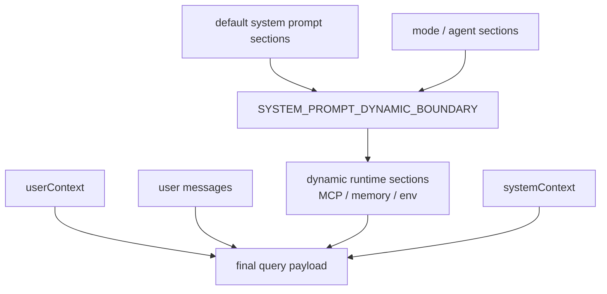

# 第 10 章 System Prompt 与上下文拼装设计

> 状态: 已完成初稿
> 章节目标: 定义 system prompt 不是常量，而是一个可组合系统。

[返回总览](/Users/magongli/Downloads/project/claude-code-sourcemap/docs/plans/2026-03-31-claude-code-runtime-reproduction/README.md)

---

这一章是整个 Claude Code 风格架构中最值得细抠的部分之一。很多人以为“系统 prompt”就是一个超长字符串，但从上游实现看，真正的设计重点从来不是“写一段神奇提示词”，而是：

- 把系统提示拆成稳定模块。
- 区分静态前缀和动态后缀。
- 明确什么属于 system prompt，什么属于 user context，什么属于 system context。
- 保证不同模式、不同 agent、不同扩展都能在同一个拼装框架下叠加。

换句话说，Claude Code 风格系统最值得学的不是 prompt 内容，而是 prompt builder 的工程化方式。

## 10.1 prompt 体系的三层结构

从 `queryContext.ts` 和 `systemPrompt.ts` 可以看出，Claude Code 风格系统实际上把前缀上下文拆成三个部分：

- `systemPrompt`
- `userContext`
- `systemContext`

在 query 发起时，大致形成：



```text
prependUserContext(messages, userContext)
+ systemPrompt
+ appendSystemContext(systemPrompt, systemContext)
```

这是一种非常重要的设计：

- `systemPrompt` 负责稳定身份、行为准则、工具使用规则。
- `userContext` 更像会话/用户侧上下文前缀。
- `systemContext` 更像环境与系统补充信息。

这种拆法比把一切都硬塞进单个 system prompt 更可控，也更利于缓存治理。

## 10.2 `getSystemPrompt()` 的真正职责

上游 `constants/prompts.ts` 里的 `getSystemPrompt()` 并不是返回一段字符串，而是返回一个 `string[]` 数组。这一点非常关键。

它意味着：

- system prompt 被视为“可组合的 section 列表”。
- 各 section 可以单独定义、单独启停、单独决定缓存边界。
- 最终 prompt 不是手拼长文本，而是由 section resolver 装配。

从 sourcemap 可以看出，它至少包含这些 section 类型：

- intro / system / doing tasks / actions / tone & style
- tool usage guidance
- output efficiency
- session-specific guidance
- memory
- env info
- language
- output style
- MCP instructions
- scratchpad
- summarize tool results
- token budget
- brief / proactive 等 feature section

这说明 Claude Code 风格系统真正采用的是“prompt registry + section composition”的思路。

## 10.3 静态前缀与动态边界

这是整个 prompt 架构里最值得借用的设计之一。

在 `constants/prompts.ts` 中，存在明确的：

```ts
SYSTEM_PROMPT_DYNAMIC_BOUNDARY
```

它的语义是：

- 该边界之前的 prompt section 尽量保持跨会话稳定，可用于全局 cache。
- 该边界之后的 section 才允许放会随 session、用户、MCP 连接、当前环境变化的内容。

这背后的思想非常强：

- prompt cache 不是模型服务层才关心的事，而是应用层 prompt builder 要主动配合的事。
- 只要把易变内容混进前缀，整个缓存命中率就会崩。

对复现项目来说，这意味着我们也应该在 prompt 设计中引入明确边界，例如：

```text
[static identity + stable policy + stable tool guidance]
=== dynamic boundary ===
[session guidance + env info + memory + mcp instructions + language/style overrides]
```

## 10.4 system prompt 不是固定文案，而是优先级系统

从 `buildEffectiveSystemPrompt()` 可以看到，真正最终生效的 system prompt 有明确优先级：

1. `overrideSystemPrompt` 完全替换一切
2. `coordinator prompt`
3. `agent prompt`
4. `custom system prompt`
5. `default system prompt`
6. `appendSystemPrompt` 总是尾部附加

这代表一个成熟系统在看待 prompt 时，不是“拼接几段字符串”，而是“做优先级决策”。

建议复现时也明确支持这几种层级：

- `default`: 产品默认行为与身份。
- `custom`: 用户显式替换默认。
- `agent`: 为特定 agent 定制行为。
- `override`: 内部强制替换。
- `append`: 在主 prompt 后附加策略或会话限定。

## 10.5 为什么 agent prompt 有时替换、有时追加

`systemPrompt.ts` 中有一个很有意思的判断：

- 正常模式下，agent prompt 可以替换 default prompt。
- 在 proactive 模式下，agent prompt 改为追加到 default prompt 后。

这说明 agent prompt 不是一个固定位置的插槽，而是取决于当前运行模式的“角色增强层”。

这个思想值得借鉴：

- 有些模式下，agent 是主身份，应替换 default。
- 有些模式下，agent 只是对主身份加一层领域能力，应追加。

所以复现设计里不应该把 `agentPrompt` 写死成一种拼法，而应把它纳入 mode-aware prompt assembly。

## 10.6 user context 与 system context 的分工

从 `fetchSystemPromptParts()` 可以看到，上游会并行拿到：

- `defaultSystemPrompt`
- `userContext`
- `systemContext`

而且当 `customSystemPrompt` 被显式设置时，`getSystemContext()` 甚至会被跳过，因为它默认是设计给 default prompt 体系使用的。

这件事说明了两个设计原则。

第一，`userContext` 和 `systemContext` 不是任意混放的附加文本，而是有依附关系的。

第二，定制 prompt 时，系统需要知道哪些默认上下文还应该存在，哪些不应该再自动注入。

建议复现时约定：

- `userContext`: 与当前用户、会话、远端控制身份、协作模式相关的上下文。
- `systemContext`: 与环境、平台、工作目录、模型、附加目录、当前 transport 相关的上下文。

## 10.7 环境信息为什么必须体系化

上游 prompt 体系里有一整块专门的环境信息 section，例如：

- 当前工作目录
- 是否 git repo
- additional working directories
- platform / shell / OS version
- 模型与知识截止信息

这不是“为了看起来详细”，而是为了让模型一开始就处于正确的运行世界观中。

原因包括：

- 工具调用强依赖工作目录和平台。
- shell 指令在不同系统上差异巨大。
- 模型能力与知识截止会影响建议。
- 多工作目录会影响文件访问边界。

因此环境信息应被视为稳定、可拼装的 prompt section，而不是某个工具需要时临时告诉模型。

## 10.8 工具指导为什么放进 system prompt

上游 prompt 里有一个非常重要的 section：指导模型优先使用专用工具，而不是一切都走 bash。

例如其设计意图大致是：

- 读文件优先走 Read tool。
- 改文件优先走 Edit/Write tool。
- 搜索优先走 Glob/Grep tool。
- Bash 应该保留给真正需要 shell 执行的场景。

这类内容之所以适合放进 system prompt，而不是仅靠工具 description，是因为它属于“全局工具使用策略”。

也就是说：

- tool description 解决“这个工具是什么”。
- system prompt 里的工具 section 解决“你在多工具环境中应该优先怎么选”。

## 10.9 session-specific guidance 为什么要后置

`constants/prompts.ts` 里专门区分了一类：

```text
session-specific guidance
```

它包含这类信息：

- 本轮有没有 AskUserQuestionTool。
- 本轮有没有 AgentTool。
- 当前会话是不是 non-interactive。
- 当前有哪些 skills。
- 当前是否开启 verification agent 等策略。

这些内容如果提前混进 static prefix，就会严重破坏缓存稳定性。

因此值得借鉴的原则是：

- 工具集的全局稳定指导可以靠前。
- 当前 session 的瞬时能力与策略，必须后置到 dynamic 区域。

## 10.10 memory、MCP、language、output style 的叠加方式

上游设计里，以下内容都不是“散落在别处”的补丁，而是正规 prompt section：

- memory prompt
- MCP server instructions
- language preference
- output style
- scratchpad instructions

这说明一个成熟系统不会把这些能力当成“额外注释”，而是纳入统一 prompt assembly 框架。

复现时建议用统一 section registry 表达：

```ts
interface PromptSection {
  id: string;
  phase: "static" | "dynamic";
  compute(ctx: PromptBuildContext): Promise<string | null>;
  cacheSensitivity?: "global" | "session" | "volatile";
}
```

这样后续接 memory、MCP、plugins、agents 时都不会破坏整体结构。

## 10.11 QueryEngine 如何消费这些 prompt parts

从 `QueryEngine.ts` 看，headless/SDK 模式不是直接调用 `getSystemPrompt()`，而是先：

1. `fetchSystemPromptParts()`
2. 合并 coordinator user context
3. 根据 custom prompt / memoryMechanics / appendSystemPrompt 拼出最终 `systemPrompt`

这说明 QueryEngine 不是 prompt 的生成源，而是 prompt parts 的消费者与最终组装者。

建议复现时把职责分清：

- `prompt registry / builder`: 负责生成各 parts。
- `query entry`: 负责根据当前会话状态、模式、agent 身份决定最终组合。

## 10.12 memory mechanics prompt 的启发

上游有一个很值得注意的小设计：当 SDK 调用方显式提供 custom system prompt，并启用 memory path override 时，会额外注入一段 memory mechanics prompt，告诉模型如何使用 memory 文件。

这个细节的启发是：

- 当你允许外部调用方替换默认 prompt 时，某些 runtime 关键机制可能会从默认 prompt 中丢失。
- 此时需要用“机制补丁 prompt”恢复模型对系统能力的理解。

因此在复现项目里，也应该考虑“能力说明补丁”这一层，而不是假设 custom prompt 永远不会破坏工具使用世界观。

## 10.13 prompt 设计的工程原则

从上游设计里可以总结出几条非常核心的工程原则。

### 10.13.1 prompt section 化

不要维护一个巨大的字符串常量。改成 section registry。

### 10.13.2 cache-aware

明确静态前缀与动态后缀边界。

### 10.13.3 mode-aware

REPL、SDK、coordinator、agent、proactive 等模式都应能在同一拼装框架内表达。

### 10.13.4 capability-aware

prompt 必须感知当前工具集、MCP 状态、memory 状态和权限语境，而不是盲目固定。

### 10.13.5 override-safe

自定义 prompt、append prompt、agent prompt、memory mechanics 这几层要有明确优先级，而不是简单字符串拼接。

## 10.14 设计总结

第 10 章最核心的结论是：

- Claude Code 风格系统真正强的不是 prompt 内容，而是 prompt builder。
- prompt 是“分段、分层、分优先级、带缓存边界”的运行时构件。
- 一旦把 prompt 工程化，agent、MCP、memory、remote、coordinator 才能持续叠加而不失控。

## 10.15 本章对复现工程的直接指导

如果你要把这一章落实成代码，建议第一版就做一个正式的 prompt builder，而不是字符串拼接工具。

### 10.15.1 建议的最小接口

```ts
type PromptAssemblyResult = {
  systemPrompt: string
  userContext: string
  systemContext: string
  cacheBoundary?: string
}
```

### 10.15.2 建议的 section 来源

- base system prompt
- mode section
- agent section
- tool/MCP capability section
- memory/compact section
- user/project custom append section

### 10.15.3 先把边界做出来，再慢慢补内容

这章最重要的不是一开始就把 prompt 写得多聪明，而是先把：

- section registry
- 优先级规则
- cache-safe boundary
- mode/agent override 入口

搭出来。

### 10.15.4 第一版不要做什么

不要：

- 把所有内容塞进一个超长模板字符串
- 让 command/agent/plugin 直接自己拼 system prompt
- 把 user context 和 system context 混成一个字段
