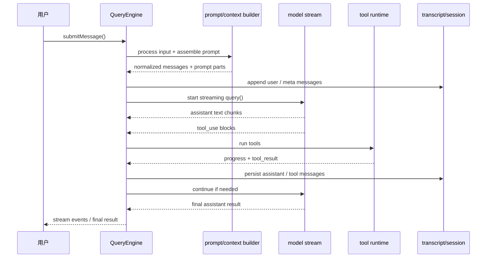

# 第 11 章 Query Engine 设计

> 状态: 已完成初稿
> 章节目标: 定义整个 Agent Runtime 的核心执行闭环。

[返回总览](/Users/magongli/Downloads/project/claude-code-sourcemap/docs/plans/2026-03-31-claude-code-runtime-reproduction/README.md)

---

这一章是整个 runtime 的心脏。如果前面的章节是在搭骨架，那么 Query Engine 就是让整副骨架真正动起来的循环系统。

从 sourcemap 看，`query.ts` 和 `QueryEngine.ts` 的关系非常清楚：

- `query.ts` 是底层一轮 query 的状态机与异步生成器。
- `QueryEngine.ts` 是更高层、面向 headless/SDK/会话对象的封装器。

理解这两层关系，是吃透整个工程逻辑的关键。

## 11.1 为什么 `query.ts` 才是真正的执行引擎

`query.ts` 定义的是：

```ts
export async function* query(params): AsyncGenerator<...>
```

这意味着 Query Engine 的底层模型不是“返回一个结果”，而是“产生一串事件与消息”。

这个设计特别重要，因为一轮 agent 执行并不是单步完成的，它天然会经历：

- request start
- assistant 流式输出
- tool_use block 到达
- tool 执行进度
- tool_result 回写
- compact boundary
- retry / recovery
- 最终成功或终止

如果把这一切硬压成一个 `Promise<Result>`，系统会立刻失去：

- 流式可观察性
- 细粒度中断点
- SDK/REPL/remote 的统一事件模型

所以 Query Engine 的正确抽象是异步事件流，而不是一次性 RPC。

## 11.2 `QueryEngine` 与 `query()` 的职责分工

上游设计给了一个非常清晰的两层分工。

### 11.2.1 `query()`

负责：

- 一轮 query 的状态机。
- 上下文预处理与 compaction 入口。
- 模型调用与流式事件消费。
- tool_use 检测与工具执行。
- 各种 recovery / retry / budget / stop hook 逻辑。
- 产出 `Message | StreamEvent | Tombstone | Summary` 等流。

### 11.2.2 `QueryEngine`

负责：

- 维持一个长期会话对象。
- 管理 `mutableMessages`、usage、permission denials、read cache。
- 在每次 `submitMessage()` 前跑输入处理和 prompt 组装。
- 把 `query()` 的产物流转成 SDK/Headless 可消费输出。
- 负责 transcript 持久化和最终 result 聚合。

可以说：

- `query()` 是单轮执行机。
- `QueryEngine` 是多轮会话容器。

## 11.3 一轮 query 的生命周期

综合 `query.ts` 和 `QueryEngine.ts`，一轮 query 的生命周期大致如下：



```text
submitMessage()
  -> fetch system prompt parts
  -> processUserInput()
  -> append messages / persist transcript
  -> call query()
      -> prepare messagesForQuery
      -> apply budgets / snip / microcompact / context collapse / autocompact
      -> assemble final prompt
      -> stream model response
      -> collect assistant messages / tool_use blocks
      -> run tools
      -> append tool results
      -> maybe continue next iteration
      -> maybe recover/retry/compact
  -> normalize output to SDK/REPL messages
  -> compute final result
```

这个生命周期里最值得注意的是：输入处理、prompt 组装、query 状态机、工具执行、最终结果整合，都是明确分层的，而不是揉成一个大函数。

## 11.4 QueryEngine 为什么要维护 `mutableMessages`

`QueryEngine` 内部维护 `mutableMessages`，不是为了偷懒，而是因为 headless/SDK 需要一个长期存活、跨 turn 的消息容器。

它承担的职责包括：

- 保留会话事实。
- 在 `processUserInput()` 前后允许 slash command 修改消息数组。
- 在 query streaming 过程中逐步追加 assistant/user/attachment/progress/system。
- 在 compact boundary 后释放旧消息，限制内存增长。

这说明 QueryEngine 不只是“包一层 query()”，而是真正的 session runtime host。

## 11.5 `query.ts` 的状态模型

在 `query.ts` 中，最值得学习的是它显式定义了 loop state：

```ts
type State = {
  messages
  toolUseContext
  autoCompactTracking
  maxOutputTokensRecoveryCount
  hasAttemptedReactiveCompact
  maxOutputTokensOverride
  pendingToolUseSummary
  stopHookActive
  turnCount
  transition
}
```

这说明它不是“while(true) 里随手改几个变量”，而是一个显式状态机。

这种写法的价值在于：

- recovery path 可以被表达为状态迁移。
- 测试可以检查 `transition.reason`，而不必只盯着消息文案。
- 后续若要抽成 reducer / step machine，也已经具备形状。

这也是我们复现时应优先借鉴的点：不要让 query loop 演化成隐式状态泥团。

## 11.6 Query 入口前的上下文预处理

真正进入模型调用之前，`query.ts` 会做大量预处理。这一点很容易被低估。

根据 sourcemap，至少包括：

- `getMessagesAfterCompactBoundary`
- `applyToolResultBudget`
- `snipCompactIfNeeded`
- `microcompact`
- `contextCollapse`
- `autocompact`

这说明在 Claude Code 风格系统中，“要发给模型的上下文”不是 transcript 的直接切片，而是一个经过多轮治理后的投影视图。

因此在复现设计里，要明确区分：

- `raw transcript`
- `messagesForQuery`

前者是事实，后者是当前回合的工作上下文。

## 11.7 为什么 compact 逻辑在 query loop 里

很多实现会把 compact 做成独立命令或后台服务，但上游把自动 compact 直接嵌进 query loop。这是一个非常关键的设计判断。

原因是：

- compact 的触发条件依赖当前 query 的 token 压力。
- compact 的结果要立刻影响当前这一轮是否继续。
- compact 后需要重新构造 `messagesForQuery` 并继续同一轮 query。

这说明 compact 不是 session 管理外围功能，而是 query continuity 的一部分。

## 11.8 模型请求为什么要走流式事件

`query.ts` 不是“拿到整条 assistant 消息后再分析”，而是在 `for await` 流式消费模型输出时处理：

- `message_start`
- `message_delta`
- `message_stop`
- assistant content blocks
- tool_use blocks

这样做有几个关键收益：

- 可以实时渲染文本。
- 可以在 tool_use block 到达时尽早启动工具执行。
- 可以捕捉 usage 和 `stop_reason` 的精确时点。
- 可以在 streaming fallback 时 tombstone 掉孤儿消息。

这其中 tombstone 机制尤其值得注意：当流式请求发生 fallback 时，旧流里已经产出的 partial assistant 消息不能继续保留，否则会污染 transcript 并破坏 thinking block 约束。

这说明 Query Engine 不只是“接流”，而是在维护一份严格一致的对话轨迹。

## 11.9 为什么有 `StreamingToolExecutor`

工具执行这块，上游明显做了两套层次：

- `runTools()`：按并发安全性分批调度。
- `StreamingToolExecutor`：在 tool_use blocks 流式到达时边收边跑。

这背后的核心思想是：

- 并非所有工具都必须等 assistant 整条消息结束后再执行。
- 工具执行本身也应该被纳入流式回合的一部分。

`StreamingToolExecutor` 做的事情包括：

- 追踪 queued/executing/completed/yielded 状态。
- 判断哪些工具可并行，哪些必须独占。
- 立即吐出 progress messages。
- 在流式 fallback、用户中断、兄弟 Bash 失败时产生 synthetic error tool_result。
- 保持结果按工具出现顺序回放。

这已经不是一个“调用函数列表”的工具框架，而是一个小型并发调度器。

## 11.10 tool_use 到 tool_result 的闭环

一轮 query 中，模型输出 `tool_use` 之后并没有结束，真正的闭环是：

```text
assistant tool_use block
  -> permission check
  -> tool execution
  -> tool_result message
  -> append to messages
  -> continue same query loop
```

上游非常强调这一点，甚至对缺失 tool_result 的情况还有专门的补偿逻辑 `yieldMissingToolResultBlocks()`。

这说明系统非常在意一条完整的不变量：

> 只要 assistant 发出过 tool_use，就必须有对应的 tool_result 返回到对话轨迹中。

这是整个 agent runtime 能稳定继续推理的基础。

## 11.11 Query 中的预算、重试与恢复

`query.ts` 里最复杂、也最体现成熟度的部分，就是各种异常与恢复路径。它处理的不是单一错误，而是一整套 runtime resilience。

至少可以看到这些治理能力：

- token blocking limit
- task budget remaining
- max output tokens escalation
- reactive compact retry
- context collapse drain retry
- stop hooks
- max turns reached
- structured output retry limit
- max USD budget stop

这说明 Query Engine 不是“发请求失败就报错”，而是一个真正会尝试自救的 runtime。

建议复现时，也把错误分层成：

- `recoverable within turn`
- `recoverable via compact/retry`
- `terminal but explainable`
- `terminal and diagnostic-heavy`

## 11.12 `QueryEngine` 如何输出最终结果

QueryEngine 的另一个重要职责，是把 query 流最终压缩成外部调用方能理解的 `result`。

从上游实现看，它会持续消费消息流，同时维护：

- `totalUsage`
- `permissionDenials`
- `turnCount`
- `structuredOutputFromTool`
- `lastStopReason`

最后再根据 terminal message 生成：

- `success`
- `error_max_turns`
- `error_max_budget_usd`
- `error_max_structured_output_retries`
- `error_during_execution`

这说明“result”不是 query 自己直接返回的，而是 QueryEngine 对流的终结性解释。

## 11.13 QueryEngine 为什么适合 SDK/Headless

上游代码里对 `QueryEngine` 的注释写得很清楚：一个 `QueryEngine` 对应一个 conversation，每次 `submitMessage()` 开启新 turn。

这恰好说明它为什么特别适合 SDK/Headless：

- 调用方可以把它当作会话对象。
- 状态跨 turn 保持。
- 输出是结构化消息流。
- 中断、恢复、usage、permission denial 都可以被包装进同一对象。

而 REPL 更接近直接围绕 `query()` 或 session state 工作。

所以复现时建议：

- 保留 `query()` 这一底层异步生成器。
- 另外提供 `QueryEngine` 这一面向编程调用的会话封装层。

## 11.14 推荐的复现接口

建议 QueryEngine 至少暴露：

```ts
interface QueryEngine {
  submitMessage(
    prompt: string | ContentBlockParam[],
    options?: { uuid?: string; isMeta?: boolean }
  ): AsyncGenerator<SDKMessage, void>;
  interrupt(): void;
  getMessages(): readonly Message[];
  getReadFileState(): FileStateCache;
  getSessionId(): string;
  setModel(model: string): void;
}
```

而底层 query 建议保持：

```ts
async function* query(params: QueryParams): AsyncGenerator<QueryEvent, Terminal>
```

## 11.15 设计总结

第 11 章最核心的结论是：

- Query Engine 不是“发模型请求”的薄层，而是整个 Agent Runtime 的执行内核。
- `query.ts` 是单轮状态机，`QueryEngine` 是多轮会话容器。
- compact、tool execution、retry、budget、stop hooks 都属于 query 生命周期，而不是外围补丁。

## 11.16 本章对复现工程的直接指导

如果只能先实现一个最小但正确的 query engine，建议严格按下面顺序落地：

1. 组装 prompt/context/messages
2. 发起流式模型请求
3. 解析 assistant 文本与 tool_use
4. 执行工具并写回 tool_result
5. 必要时递归继续 query
6. 落 transcript 与 usage

### 11.16.1 第一版先支持一轮一个 tool batch

先保证：

- assistant text 可流式输出
- tool_use 可识别
- tool_result 可回写
- 递归继续可工作

不要一开始就做太多优化。

### 11.16.2 QueryEngine 与 `query()` 必须分层

- `query()` 处理单轮状态机
- `QueryEngine` 处理会话消息、中断、模型切换、外部 API

这层分开后，后面的 SDK/remote/agent 都好接。

### 11.16.3 先用 profiler 把主链路钉住

这一章真正落地时，最好同时插入：

- startup profiler
- query profiler
- tool execution checkpoints

这样你后面做 compact、MCP、plugin 时，能清楚看到 query 主链路是否被拖慢。
