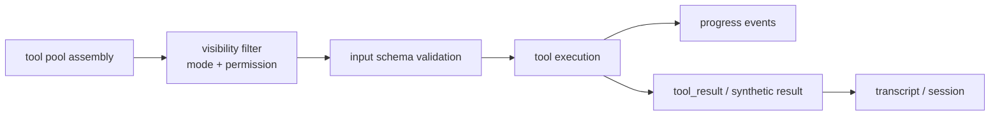

# 第 12 章 Tool 系统设计

> 状态: 已完成初稿
> 章节目标: 把“模型可调用能力”标准化。

[返回总览](/Users/magongli/Downloads/project/claude-code-sourcemap/docs/plans/2026-03-31-claude-code-runtime-reproduction/README.md)

---

Claude Code 风格系统的另一根中轴，就是工具系统。这里最值得学的，不是“它有哪些工具”，而是“它如何把工具变成一个可治理、可扩展、可记录、可并发调度的能力平面”。

如果没有这套工具系统，Claude Code 风格工程就会退化成“模型输出命令，然后宿主去执行”的脆弱模式。真正成熟的地方，是它把工具正式化了。

## 12.1 工具系统要解决的根本问题

工具系统同时要满足四方诉求：

- 对模型：工具是可理解、可选择、可调用的能力。
- 对 runtime：工具是受权限约束、可观察、可回写的副作用单元。
- 对开发者：工具是可注册、可测试、可组合的模块。
- 对产品：工具要支持内置能力、MCP 扩展、agent、skills、plugins 的长期共存。

所以工具系统的本质不是“函数表”，而是一个带 schema、策略、上下文和回写机制的运行子系统。



## 12.2 `Tool` 抽象的关键点

从 `Tool.ts` 和相关实现看，一个成熟的 `Tool` 至少应具备：

- `name`
- `description`
- `inputSchema`
- `isEnabled()`
- `isConcurrencySafe()`
- `interruptBehavior()`
- `invoke()`

其中最关键的不是字段列表，而是这些设计选择：

- `inputSchema` 让工具调用是可验证的。
- `isEnabled()` 让工具可按环境/模式/feature gate 显隐。
- `isConcurrencySafe()` 让调度器决定是否可并行。
- `interruptBehavior()` 让 runtime 决定用户打断时的策略。

这说明工具定义本身已经包含调度语义，而不仅是业务语义。

## 12.3 `ToolUseContext` 为什么是工具系统中枢

`ToolUseContext` 是整个工具系统最重要的中枢接口之一。

从上游定义看，它不仅包含：

- `options.tools / commands / mcpClients / agentDefinitions`
- `abortController`
- `readFileState`
- `getAppState / setAppState`

还包含大量运行时接口，例如：

- `setInProgressToolUseIDs`
- `setHasInterruptibleToolInProgress`
- `setResponseLength`
- `updateFileHistoryState`
- `updateAttributionState`
- `requestPrompt`
- `handleElicitation`
- `addNotification`
- `appendSystemMessage`

这说明工具不是跑在一个“纯函数沙盒”里，而是跑在运行时框架提供的受控环境里。

值得借鉴的核心原则是：

- 工具不直接依赖全局单例。
- 工具对 runtime 的交互通过 context 暴露。
- 只把经过设计允许的能力开放给工具。

## 12.4 base tools、special tools 与 feature gating

`tools.ts` 的设计非常值得学习。它不是简单导出一个数组，而是：

- 定义 `getAllBaseTools()`
- 再经 `getTools(permissionContext)` 做模式和 deny 规则过滤
- 再经 `assembleToolPool(permissionContext, mcpTools)` 合并 MCP 工具

而且内置工具本身还会受：

- feature flags
- env flags
- 平台能力
- mode 开关
- REPL 特殊行为

影响。

这说明工具池装配是 runtime 的职责，不是每个入口自己拼。

## 12.5 为什么 `tools.ts` 是“装配中心”而不是“工具目录索引”

`tools.ts` 里做的事远不止“导出工具”：

- 简单模式下裁剪工具池。
- REPL 模式下隐藏 primitive tools。
- 通过 deny rules 过滤工具可见性。
- 保持 built-in 与 MCP tool 的排序稳定。
- 按名字去重，让 built-in 优先。

这几点背后都是系统级约束：

- 权限影响工具可见性，不只是执行时审查。
- 模式影响工具暴露，不只是文档展示。
- 工具排序影响 prompt cache。
- MCP 扩展不能随意打乱内置工具前缀。

## 12.6 prompt cache 为什么会影响工具排序

这也是一个很容易被忽略、但很体现成熟度的细节。

上游在 built-in tools 与 MCP tools 合并时，专门强调：

- built-ins 保持连续前缀。
- 各分区内部稳定排序。
- 避免平铺排序导致 MCP 工具插进 built-in 中间，从而破坏下游缓存键。

这意味着在 Claude Code 风格系统里，“工具列表”不仅是能力集合，也是 prompt 前缀的一部分。

所以复现时应明确：

- 工具排序不是随意的。
- 装配逻辑必须稳定、可重复。
- 任何扩展机制都不应破坏内置工具前缀稳定性。

## 12.7 deny rules 为什么在模型看到工具之前就生效

上游 `filterToolsByDenyRules()` 的作用，不是阻止工具执行，而是直接把 blanket-denied 工具从工具池里移除。

这说明权限有两层：

- `visibility filtering`: 模型根本看不到这项能力。
- `invocation decision`: 模型调用时再做更细粒度允许/拒绝。

这个设计非常重要，因为：

- 如果模型先看到能力，再在执行时被拦住，会浪费推理并增加摩擦。
- 某些 MCP server prefix deny 规则本来就是想彻底移除整类能力。

因此复现时应把权限整合进工具装配阶段，而不是只在 `invoke()` 前做校验。

## 12.8 `runTools()` 的调度模型

`toolOrchestration.ts` 展示了一个非常清晰的调度思路：

- 先按工具调用顺序分批。
- 每批要么是一个非并发安全工具。
- 要么是一组连续的并发安全工具。

对应逻辑大致是：

```text
tool_use blocks
  -> partitionToolCalls()
  -> run serial batches for unsafe tools
  -> run concurrent batches for safe tools
  -> apply queued context modifiers
```

这说明上游并没有采用“全部并行”或“全部串行”的粗暴方式，而是让工具自己声明并发语义，再由调度层执行。

## 12.9 `isConcurrencySafe()` 的价值

这是工具系统里一个非常关键、但很容易被忽略的设计点。

对于某些工具：

- 读文件、搜索类操作通常可以并行。
- 编辑文件、写文件、执行某些 shell 命令往往不安全。

如果工具定义层不表达这个语义，调度器就只能保守地全部串行，或者危险地全部并行。

所以复现时建议：

- 把并发安全性作为工具定义的一部分。
- 默认保守，只有明确安全的工具才允许并发。

## 12.10 `StreamingToolExecutor`：工具执行器为什么像个小 runtime

这是上游工具系统最精彩的部分之一。

`StreamingToolExecutor` 做的事情包括：

- 维护 tool queue。
- 判断当前哪些 queued 工具可以启动。
- 区分 `queued / executing / completed / yielded` 状态。
- 立即吐出 progress 消息。
- 保证结果按工具到达顺序回放。
- 在 Bash 错误时取消并行兄弟工具。
- 在用户中断或 streaming fallback 时生成 synthetic error blocks。

换句话说，它不只是一个 executor，更像是“query loop 内嵌的小型工具任务 runtime”。

## 12.11 为什么只在 Bash 失败时取消兄弟工具

上游 `StreamingToolExecutor` 有个很细的策略：

- 如果某个工具出错，不一定取消其他并行工具。
- 但如果是 Bash 出错，会触发 sibling abort。

原因也非常合理：

- Bash 工具常常代表命令链的一部分，失败后后续 shell 结果可能都失去意义。
- Read、WebFetch 这类工具更独立，一个失败不应拖垮其他并行查询。

这说明工具系统的恢复策略不应该一刀切，而要允许按工具类别定制。

## 12.12 synthetic error / synthetic tool_result 的必要性

一个成熟的 agent runtime 不仅要处理真实工具结果，还要处理“理论上应该有结果，但因为中断、fallback、并发取消没来得及正常返回”的情况。

上游为此专门做了 synthetic tool_result，例如：

- user_interrupted
- sibling_error
- streaming_fallback
- missing tool

这背后的不变量仍然是：

> 只要 assistant 发过 tool_use，系统就要尽力回填一个 tool_result，哪怕它是 synthetic 的错误结果。

这个设计很关键，因为它能保持消息轨迹闭合，让后续模型与 replay 都不出现悬空调用。

## 12.13 progress message 为什么要单独处理

从 `StreamingToolExecutor` 和 `QueryEngine` 都能看出，progress message 被特殊对待：

- 工具执行时可以随时产生 progress。
- progress 会优先即时 yield。
- 但它又不应当与最终 tool_result 混淆。

因此建议在复现中明确：

- progress 是正式消息类型。
- 它服务 UI、SDK 和 remote 观察。
- 但它不是会话事实的最终结论。

## 12.14 `runToolUse()` 的真正角色

虽然我们没有在这里逐行拆完 `toolExecution.ts`，但从外围调用关系已经很清楚：

- `runToolUse()` 是单个工具调用的细粒度执行器。
- 它内部串起 schema 校验、权限判定、hooks、实际执行、结果标准化和 telemetry。

也就是说，工具系统不是：

```text
tool block -> tool.invoke()
```

而是：

```text
tool block
  -> find tool
  -> parse/validate input
  -> permission decision
  -> run pre-tool hooks
  -> invoke tool
  -> normalize tool result / attachments / progress
  -> run post-tool hooks
  -> return message updates + context modifiers
```

这个“context modifiers”也很关键，因为它说明工具可以合法地改变后续 query 的运行上下文，但必须通过受控 modifier 回写。

## 12.15 工具结果为什么不能只是一段文本

上游工具结果可能被落成：

- `user` message 中的 `tool_result`
- `attachment` message
- `progress` message
- `tool_use_summary`

这意味着工具输出不是单一通道，而是多通道结果系统。

复现时建议至少支持：

- 面向模型继续推理的标准 `tool_result`
- 面向 UI/SDK 的 progress
- 面向结构化消费的 attachment/artifact
- 面向日志与调试的 metadata

## 12.16 MCP 工具为何能接进同一工具池

之所以 Claude Code 风格系统能把 MCP 工具接进来，却不把整体弄乱，就是因为它先有稳定的 `Tool` 抽象和装配流程。

MCP 工具进入系统后，仍然需要经过：

- 名称规范化
- deny rule 过滤
- 工具池合并
- prompt 排序稳定化
- 调用期权限判断

所以 MCP 在这里不是第二套工具系统，而是同一工具平面的外部来源。

这也是复现时必须守住的原则：扩展来源可以不同，运行时工具语义必须统一。

## 12.17 工具系统的推荐接口层次

建议复现项目中把工具系统拆成以下层次：

### 12.17.1 Tool Definition Layer

定义工具元信息、schema、并发语义、interrupt 语义。

### 12.17.2 Tool Registry / Pool Assembly Layer

负责 base tools、feature-gated tools、mode filter、permission visibility filter、MCP 合并。

### 12.17.3 Tool Execution Layer

负责单个 tool_use 的权限、hooks、invoke、结果标准化。

### 12.17.4 Tool Orchestration Layer

负责多 tool_use 的批处理、并发调度、顺序保证。

### 12.17.5 Streaming Tool Runtime Layer

负责流式工具执行、进度回传、取消、fallback、synthetic result。

## 12.18 设计总结

第 12 章最核心的结论是：

- 工具系统不是函数表，而是能力运行时。
- `Tool` 定义层、工具池装配层、单调用执行层、多调用编排层、流式执行层必须分开。
- 权限、排序稳定性、并发安全、synthetic result、progress 消息，都是成熟工具系统不可缺的部分。

## 12.19 本章对复现工程的直接指导

建议你按下面顺序把工具系统搭起来，而不是一次性把所有工具写满。

### 12.19.1 第一步: 冻结 `Tool` 接口

先确定：

- 名称
- 输入 schema
- 调用入口
- permission 关联方式
- progress/result 回写方式

### 12.19.2 第二步: 只实现最小工具集

建议先做：

- `Read`
- `Edit` 或 `Write`
- `Bash`

这三个已经足以跑通大部分 agent 闭环。

### 12.19.3 第三步: 做统一工具池装配

把：

- base tools
- mode filter
- permission visibility filter
- MCP tools

统一收进一个 assemble 阶段，不要到处临时拼列表。

### 12.19.4 第四步: 做单调用执行器，再做批量编排

先有：

- `executeToolUse()`

再有：

- `runTools()`
- `StreamingToolExecutor`

不要反过来。

### 12.19.5 第五步: 让每次工具调用都能写回 transcript

只要 tool_use / tool_result / progress 都进入统一事件流，后面的：

- replay
- diagnostics
- remote
- background task

都会容易很多。
