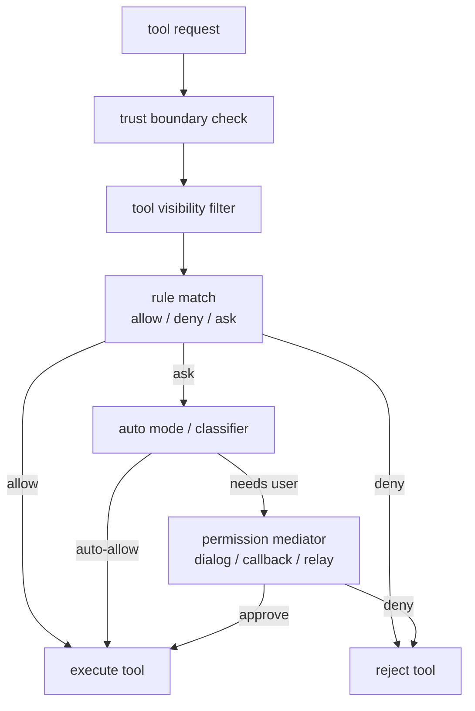

# 第 14 章 权限、信任与沙箱设计

> 状态: 已完成初稿
> 章节目标: 把安全边界做成架构的一部分，而不是补丁。

[返回总览](/Users/magongli/Downloads/project/claude-code-sourcemap/docs/plans/2026-03-31-claude-code-runtime-reproduction/README.md)

---

这一章讲的是 Claude Code 风格系统最不可忽视、也最容易被轻视的一层：权限与信任。

很多人会把权限理解成“工具执行前弹个框”，但从上游实现看，真正的设计完全不是这样。Claude Code 风格系统里的权限是一个横切运行时的策略平面，它会影响：

- 工具是否对模型可见
- 工具参数是否允许
- 当前模式是否可自动批准
- headless/async agent 能否继续
- 哪些工作区内容在 trust 建立前就不该被加载

所以本章的核心判断是：

> 权限不是 UI 交互，而是 runtime policy engine。



## 14.1 信任边界为什么必须先于权限模式

权限系统生效之前，系统必须先判断“哪些东西是可信的”。

Claude Code 风格系统里至少有几层不同信任等级：

- runtime 核心代码
- 用户全局配置
- 当前工作区
- 当前仓库文件
- hooks
- plugins
- MCP server 响应
- remote peer

这里一个特别重要的判断是：

> 当前工作区不是天然可信的。

因为仓库里可能有：

- 恶意 prompt injection
- 误导性文档
- 会诱导危险命令的脚本
- 会影响系统行为的本地配置

因此 workspace trust 不是礼貌性的提示，而是决定“哪些工作区相关内容可以进入 runtime”的前置条件。

## 14.2 `ToolPermissionContext` 是权限系统核心快照

从 `Tool.ts` 看，权限上下文不是零散变量，而是正式对象 `ToolPermissionContext`。

它至少包含：

- `mode`
- `additionalWorkingDirectories`
- `alwaysAllowRules`
- `alwaysDenyRules`
- `alwaysAskRules`
- `isBypassPermissionsModeAvailable`
- `shouldAvoidPermissionPrompts`
- `awaitAutomatedChecksBeforeDialog`
- `prePlanMode`

这说明权限系统并不是只维护一个“当前模式”，而是维护一整套决策语境。

其中最关键的点是：

- 规则不是单一数组，而是按行为分层。
- 权限模式不是单一逻辑分支，而是上下文的一部分。
- 一些模式信息还要跨 plan/auto 切换保存。

## 14.3 权限规则的来源模型

从 `permissions.ts` 可以看出，规则来源非常正式，至少包括：

- `userSettings`
- `projectSettings`
- `policySettings`
- `cliArg`
- `command`
- `session`

这说明权限规则不仅有内容，还有来源语义。这个设计非常重要，因为它决定：

- 规则优先级如何解释
- 规则 UI 如何展示来源
- 权限更新该持久化到哪里
- 用户如何理解“为什么这条规则会生效”

建议复现时也采用：

```ts
interface PermissionRule {
  source: PermissionRuleSource;
  ruleBehavior: "allow" | "deny" | "ask";
  ruleValue: PermissionRuleValue;
}
```

而不是只维护一组字符串。

## 14.4 allow / deny / ask 三层语义

Claude Code 风格系统没有把权限简化成“允许 / 不允许”，而是显式保留三层：

- `allow`
- `deny`
- `ask`

这三者分别代表：

- `allow`: 在当前语境下可以直接执行。
- `deny`: 根本不能执行。
- `ask`: 当前系统无法直接决定，需要进入交互/审批/分类器流程。

这个 `ask` 状态极其重要，因为它让权限系统变成了“有中间态的决策机”，而不是死板的布尔判断。

## 14.5 工具可见性为什么受 deny 规则影响

上游不仅在调用时检查权限，还在装配工具池时直接用 deny 规则裁掉工具可见性。

也就是说，权限影响有两层：

- `visibility filtering`
- `invocation decision`

这种设计非常成熟，因为：

- 某些工具模型根本不该看到
- 某些 MCP server 整体就不该暴露
- 如果先给模型看见，再在执行期拒绝，只会增加无效推理和用户摩擦

所以复现时必须把权限系统嵌入：

- tool pool assembly
- agent filtering
- command/remote capability filtering

而不是只嵌到 `invoke()` 之前。

## 14.6 权限判定链路的真正复杂度

从 `hasPermissionsToUseTool()` 和相关函数可以看出，Claude Code 风格权限判定远不是一个 `if mode === allow`。

它大致会经历这些层次：

1. 工具级 deny / allow / ask 规则
2. 按内容匹配的规则
3. 特殊安全检查
4. hooks 干预
5. 当前模式语义
6. auto mode 分类器
7. headless/async agent 降级策略
8. 最终持久化权限更新

这说明权限系统其实是一条策略流水线，而不是单点判断。

## 14.7 `checkRuleBasedPermissions()` 的价值

虽然我们这里没有把 `permissions.ts` 全部逐行展开，但从导出的函数结构能看出，上游非常重视：

- 工具整体匹配
- 工具内容匹配
- agent deny 规则
- rule-by-contents 映射

这背后的关键点在于：

- `Bash(*)` 和 `Bash(prefix:*)` 语义不同
- `Agent(Explore)` 与 `Agent(*)` 也是不同粒度
- MCP tool 的 server 级与 tool 级规则也不同

因此复现时要避免一个太粗的规则语法。至少要能表达：

- 工具整体
- 工具内容
- server 级范围
- path / network / agent 类型范围

## 14.8 auto mode 与分类器为什么需要“危险规则剥离”

`permissionSetup.ts` 里很值得学的一点，是它会识别“危险权限规则”，尤其是对 auto mode 来说会破坏分类器的规则。

例如：

- `Bash(*)`
- `Bash(python:*)`
- 某些 PowerShell 任意执行规则
- AgentTool 的泛允许规则

这些规则一旦存在，就会导致：

- 模型在 auto mode 下绕过分类器
- 任意代码执行提前被白名单化

所以上游不仅支持 auto mode，还在进入 auto mode 前主动检查并剥离危险规则。这是非常成熟的“安全设计反向约束产品能力”的例子。

## 14.9 `acceptEdits` fast path 与 auto allowlist

从 `hasPermissionsToUseTool()` 看，auto mode 并不是所有 ask 都会进入分类器。上游显式做了几层“低成本放行路径”：

- 如果某个动作在 `acceptEdits` 模式下会被允许，则可跳过分类器。
- 某些 allowlisted safe tools 可直接通过。

这个设计很重要，因为：

- 分类器调用本身有延迟和成本。
- 不是每个 ask 都值得走重审批链路。

所以一个成熟权限系统不是“越严格越好”，而是：

- 把高风险动作送进重路径
- 把低风险动作走快路径

这也是 runtime 产品体验的关键。

## 14.10 denial tracking 与 fail-closed

Claude Code 风格权限系统还考虑了连续拒绝、分类器不可用和 headless 场景。

从代码中能看出这些机制：

- denial tracking state
- consecutive denials
- fallback to prompting
- classifier unavailable message
- shouldAvoidPermissionPrompts

这说明权限系统不是只为 REPL 设计的，而是从一开始就考虑：

- 无法弹框的后台 agent
- 无法人工确认的 headless 调用
- 分类器异常的 fail-closed 策略

这是非常值得借鉴的。

## 14.11 headless / async agent 的权限降级路径

在 `runPermissionRequestHooksForHeadlessAgent()` 可以看到，上游对“不能显示审批 UI 的上下文”并没有直接粗暴 deny，而是先给 hooks 一次机会。

大致路径是：

```text
headless/async agent
  -> run PermissionRequest hooks
  -> if hook decides, honor it
  -> else fallback auto-deny
```

这个设计很巧妙，因为它允许：

- 企业策略或自定义 hooks 在无 UI 环境下仍参与审批
- 但系统默认仍然 fail-closed

这比简单的“headless 一律允许”或“一律拒绝”都更合理。

## 14.12 agent、MCP、PowerShell 的特殊处理

从权限代码能看到，Claude Code 风格系统并不假设所有工具都是同一风险模型。

它对一些特殊能力做了专门判定：

- `AgentTool`
- `BashTool`
- `PowerShellTool`
- `REPLTool`
- MCP tools

尤其是：

- agent permission 会单独按 agent type 过滤
- MCP tool 会使用 `mcp__server__tool` 规范名参与规则匹配
- PowerShell 在 auto mode 下有额外限制

这说明工具系统虽然统一，但权限系统仍允许按能力类别注入特化规则。这个弹性是必须的。

## 14.13 sandbox 为什么不是独立系统

从 `permissions.ts` 与 `permissionSetup.ts` 的关系看，sandbox 不是一个和权限并排的后处理器，而是权限语义的一部分。

例如：

- 某些动作会以 `sandboxOverride` 的形式进入决策原因
- Bash/PowerShell 是否走 sandbox 会影响审批语义

这意味着 sandbox 不应该被设计成“命令执行层的小开关”，而应纳入权限引擎的最终决策链路。

## 14.14 permission mode 的推荐语义

基于上游实现，复现时建议至少保留这些模式语义：

- `default`
- `acceptEdits`
- `dontAsk`
- `auto`
- `plan`

如果后续支持更强模式，也要保证这些模式并不是 UI label，而是会被工具、Query Engine、权限引擎共同消费的正式枚举。

## 14.15 权限请求生命周期

建议把权限请求生命周期明确写成：

```text
tool_use arrives
  -> derive permission context
  -> evaluate visibility + rules
  -> if allow: continue
  -> if deny: synthesize denial result
  -> if ask:
       -> hooks / classifier / prompt / callback
       -> maybe persist update
       -> continue or deny
```

这条链路的好处是：

- 所有模式都能共享
- REPL 只是 ask 的一种宿主界面
- SDK/headless 可以用 callback 或 hook 替代

## 14.16 本章结论

第 14 章最重要的结论有五个：

- 权限系统是 runtime policy engine，不是弹框组件。
- trust 先于 permission mode，是更上层的安全边界。
- allow / deny / ask 三层语义必须保留。
- auto mode 不是放权，而是更复杂的策略引擎，需要危险规则剥离和分类器兜底。
- sandbox、agent、MCP、headless 都必须接进同一权限体系，而不是各玩各的。

## 14.17 本章对复现工程的直接指导

权限系统最容易在“先跑通功能，后面再补”这一步彻底失控。复现时建议你反过来，先把权限主干做薄但做真。

### 14.17.1 第一版就保留 `allow / ask / deny`

不要先做一个布尔开关式 `canRun`。  
最小也要返回：

- 最终决策
- 决策原因
- 是否需要人工确认

否则 headless、agent、remote 一进来，你就会发现之前的权限接口表达不了真实语义。

### 14.17.2 trust 与 permission mode 必须拆成两层

建议最少做两个入口：

- `evaluateWorkspaceTrust()`
- `evaluateToolPermission()`

如果把 trust 和 tool-level permission 混在一起，你后面就分不清“这个工作区根本不可信”还是“这个工具在当前模式不允许”。

### 14.17.3 权限过滤要发生在工具可见性之前

最小流程应该是：

1. 组装候选工具池
2. 根据 deny / availability / mode 过滤工具可见性
3. 再把结果暴露给模型
4. tool_use 时再做一次执行前判定

少了前面的可见性过滤，模型会频繁学会调用一个本来不该看到的危险工具。

### 14.17.4 REPL 只是 ask 的宿主，不是 ask 本身

第一版就把 ask 设计成宿主无关接口，例如：

- REPL 弹窗
- headless callback
- SDK hook
- remote permission relay

这样权限系统才能真正服务多入口，否则你后面一定会为每个模式补一个分叉版本。

### 14.17.5 第一版推荐目录

```text
permissions/
  trust/
  rules/
  modes/
  evaluation/
  prompts/
  sandbox/
```

本章真正帮你省下的，是后面整个 runtime 最昂贵的返工。如果权限不是正式子系统，它迟早会退化成几十个“先放行，后拦截”的散点 if/else。
