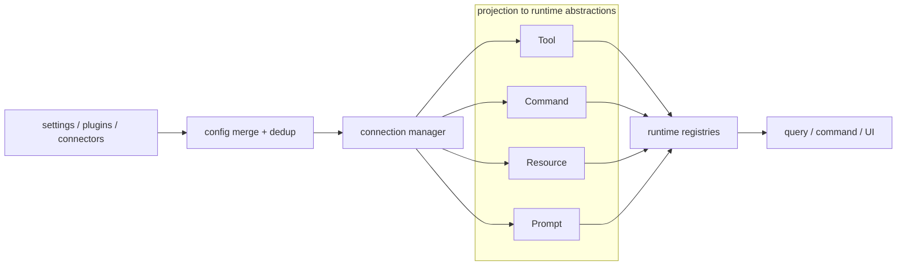

# 第 16 章 MCP 集成设计

> 状态: 已完成初稿
> 章节目标: 为系统引入协议级扩展平面。

[返回总览](/Users/magongli/Downloads/project/claude-code-sourcemap/docs/plans/2026-03-31-claude-code-runtime-reproduction/README.md)

---

MCP 是 Claude Code 风格系统能持续扩展而不把内核搞散架的关键机制之一。因为它提供的不是“再加一类插件”，而是一个协议级扩展平面。

这章最重要的判断是：

> MCP 不是外挂工具箱，而是进入统一 runtime 的外部能力来源。



如果没有这层统一语义，外部 server 很容易变成：

- 第二套工具系统
- 第二套权限系统
- 第二套 prompt 注入系统
- 第二套认证和连接状态管理系统

而 Claude Code 风格系统的厉害之处，就在于它把这些都收编进了统一架构。

## 16.1 MCP 在总架构中的位置

MCP 集成位于“扩展能力层”和“协议接入层”的交界处：

```text
config / settings / plugin-provided servers
  -> MCP config merge
  -> connection manager
  -> tools / resources / prompts / commands projection
  -> runtime registries
  -> query / command / UI consumption
```

这说明 MCP 不是直接被 Query Engine 调用，而是先被投影成系统内已有抽象：

- `Tool`
- `Command`
- `Resource`
- `Prompt`

这一步“投影”是关键。

## 16.2 MCP 配置模型为什么这么重

从 `services/mcp/types.ts` 和 `config.ts` 看，Claude Code 风格系统把 MCP 配置做得非常正式。

它至少区分了这些 scope：

- `local`
- `user`
- `project`
- `dynamic`
- `enterprise`
- `claudeai`
- `managed`

以及这些 transport：

- `stdio`
- `sse`
- `sse-ide`
- `http`
- `ws`
- `sdk`
- `claudeai-proxy`

这说明上游从一开始就没有把 MCP 只当成本地子进程，而是当成“多 transport、多来源、多管理域”的能力面。

## 16.3 配置来源合并为什么是 MCP 的核心难点

`getAllMcpConfigs()` 这一类函数之所以重要，是因为 MCP server 不是只来自一个地方。

至少会来自：

- 用户手工配置
- 项目配置
- managed / enterprise 配置
- plugin 提供的 servers
- claude.ai connectors

这意味着 MCP 集成的第一问题不是“怎么连”，而是“最终有哪些 server 应该存在”。

上游为此做了很多成熟设计：

- 分 scope 建模
- 统一转成 `ScopedMcpServerConfig`
- 在 merge 前做 dedup
- 把 disabled server 作为正式状态保留

这比“读一个 JSON 文件然后连起来”高了不止一个层级。

## 16.4 content-based dedup 为什么重要

`config.ts` 里很值得借鉴的一点，是它不是只按 name 去重，而是会给 MCP server 计算 signature。

signature 可能来自：

- stdio command + args
- remote url

而且还会对 claude.ai proxy URL 做 unwrap，恢复原始 vendor URL 再比对。

这说明上游意识到：

- 不同来源的 server 可能名字不同
- 但它们实际连的是同一个底层 MCP 服务

如果不做 content-based dedup，就会出现：

- 插件和手动配置重复接入同一个 server
- claude.ai connector 和手写 url 重复
- 工具列表重复膨胀

这会直接影响 prompt、UI 和权限。

## 16.5 disabled / pending / needs-auth 都必须是一等状态

从 `types.ts` 看，MCP connection 状态不是简单的 connected / failed，而是至少包括：

- `connected`
- `failed`
- `needs-auth`
- `pending`
- `disabled`

这个状态机设计非常成熟，因为它让系统能明确表达：

- 这个 server 被手动关闭了
- 这个 server 正在重连
- 这个 server 需要认证，不是单纯失败
- 这个 server 已连上并可贡献能力

如果把这些都压成 `error`，UI、权限、调试和自动恢复都会非常混乱。

## 16.6 MCP client manager 的职责

从 `client.ts` 可以看出，MCP client manager 实际上承担了很多职责：

- 按配置建立 transport
- 维护连接缓存
- 处理 reconnect
- 处理 needs-auth cache
- 在断开时清理 pending 请求
- 拉取 tools / resources / prompts / commands
- 包装成 runtime 内部对象

换句话说，它不只是一个 SDK client 包装器，而是完整的 connection orchestration 层。

## 16.7 认证为什么是 MCP 集成里单独的一层

上游对认证处理得非常正式，尤其体现在：

- OAuth config
- XAA 相关字段
- `needs-auth` 缓存
- 401/Unauthorized 特判
- `McpAuthError`
- 远程 transport 的 auth failure 统一处理

这说明在 Claude Code 风格系统里，认证不是 transport 附属品，而是连接生命周期的一部分。

特别是 `needs-auth` 缓存很值得借鉴，因为它避免：

- 同一个 server 每次启动都反复失败
- 每一轮都重新尝试一条已知需要登录的连接

## 16.8 `ensureConnectedClient()` 的价值

从 `client.ts` 结构看，上游显式区分：

- 当前持有的是不是 connected client
- 如果 session 过期，要不要自动重连

也就是说，MCP connection 不是一次 connect 后永远有效的假设，而是：

- 可失效
- 可重建
- 调用前需要确认

这在远程 transport、SSE、HTTP、OAuth 环境下非常重要。

## 16.9 MCP 工具为什么必须被包装成系统 Tool

Claude Code 风格系统并没有让模型直接使用原始 MCP tool schema，而是会把它们包装进统一 Tool 平面。

这一步的作用包括：

- 统一命名
- 统一权限检查
- 统一结果处理
- 统一 telemetry
- 统一 query 集成

上游甚至专门为 MCP 提供：

- `MCPTool`
- `ListMcpResourcesTool`
- `ReadMcpResourceTool`
- `McpAuthTool`

这说明 MCP 在系统里的身份不是“特判能力”，而是“被适配后的系统工具族”。

## 16.10 名称规范化为什么不可省

从 `mcpStringUtils.ts` 可见，上游会把 MCP tool 名字构造成：

```text
mcp__serverName__toolName
```

并用这个规范名参与：

- 权限规则匹配
- 工具池去重
- display name 提取

这非常关键，因为如果 MCP tool 用原始 display name，例如 `Write`，就会和内置工具冲突。

所以复现时必须明确：

- 对模型和权限系统使用 fully-qualified MCP name
- 对 UI 再另外提供 display name

## 16.11 MCP 不只是工具，还包括 resources / prompts / commands

这也是 Claude Code 风格系统比很多简化实现更完整的地方。

MCP 接入的不只是 tool，还有：

- resource
- prompt
- command
- skill

这意味着 MCP 是一个真正的“外部能力协议”，不是只提供函数调用。

因此复现时建议明确四个投影通道：

- tool projection
- resource projection
- prompt projection
- command/skill projection

否则后期再补 resource/prompt 会非常别扭。

## 16.12 Resource tools 的设计启发

上游内置了：

- `ListMcpResourcesTool`
- `ReadMcpResourceTool`

这很有意思，因为它表明 Claude Code 风格系统并没有要求模型必须自己理解“有哪些 resource API 可用”，而是提供了统一桥接工具。

这种桥接设计非常值得复现，因为它让：

- 资源发现
- 资源读取
- 权限控制
- UI 展示

都能走统一逻辑，而不必让每个 MCP server 自己想办法渗透进系统。

## 16.13 MCP prompt / command / skill 的统一投影

从整体结构看，上游会把 MCP prompt/skill 也映射进命令系统。这一点非常重要，因为它再次证明：

- 命令系统是统一入口平面
- MCP 只是来源之一

也就是说，复现时不要做成：

- 内置 commands 一套
- MCP prompts 一套
- plugin skills 一套

而应该尽量让这些都落入统一 `Command` 抽象，再按视图消费。

## 16.14 MCP 与权限系统的耦合点

MCP 集成真正难的地方，不在连通，而在治理。

上游至少做了这些关键耦合：

- MCP tool 名称参与 deny/allow 规则匹配
- server 级 prefix 规则可整体裁掉某个 server
- MCP 工具先过工具池过滤，再进入调用期权限
- MCP 结果进入统一 tool execution 和 transcript

这说明 MCP 从来不是“权限系统外的特权通道”。

这是复现时必须坚持的原则。

## 16.15 大输出与二进制结果怎么处理

`client.ts` 里还体现了很成熟的一点：MCP 输出可能非常大，甚至包含二进制或图片内容。

因此上游会处理：

- large output truncation / persistence
- binary persistence
- 图片尺寸调整
- 输出大小估算

这说明 MCP tool result 不是“拿来就塞进 transcript”，而需要经过专门的结果治理层。

这与内置工具系统的理念是完全一致的。

## 16.16 URL elicitation retry 的设计意义

`callMCPToolWithUrlElicitationRetry()` 这类逻辑说明，上游把某些 MCP 交互失败视为“需要用户补充信息的协议级对话”，而不是普通错误。

这特别值得借鉴，因为很多外部系统能力并不总是一次就能成功，它们可能需要：

- URL 授权
- 用户确认
- 登录跳转
- 额外参数补全

如果 MCP 层不理解这种交互，就只能把所有问题都扔回 Query Engine 变成人类读不懂的错误。

## 16.17 MCP 与 prompt cache 的关系

Claude Code 风格系统对 MCP 指令还有一个非常成熟的处理：

- 某些 MCP instructions 被放在动态区域
- 甚至支持用 delta attachment 的形式发布，而不是每轮重算整段 prompt

这说明上游已经意识到：

- MCP server 连接状态变化会影响 prompt
- 如果每次都把 instructions 直接重拼进主 prompt，会持续打碎缓存

所以复现时也应当把“MCP instructions 如何进入上下文”视为 cache-sensitive 设计问题，而不是简单拼文本。

## 16.18 IDE / sdk / remote transport 是为什么存在

从 transport 类型能看到，Claude Code 风格系统不仅支持：

- stdio
- SSE
- HTTP
- WS

还支持：

- `sse-ide`
- `ws-ide`
- `sdk`
- `claudeai-proxy`

这说明 MCP 在 Claude Code 风格系统里已经不是“本地开发者玩具”，而是面向：

- IDE 宿主
- 远程会话
- web / mobile 代理链路

的统一能力协议。

这也是为什么 MCP 集成必须被设计成正式子系统，而不是一个 helper file。

## 16.19 推荐的 MCP 分层

复现时建议把 MCP 至少拆成这些层次：

- `mcp/types`
- `mcp/config`
- `mcp/dedup`
- `mcp/connection-manager`
- `mcp/auth`
- `mcp/tool-projection`
- `mcp/resource-projection`
- `mcp/prompt-command-projection`
- `mcp/output-governance`

这样后续接 OAuth、IDE transport、remote proxy 时才不会全塞进一个 client 文件。

## 16.20 本章结论

第 16 章最重要的结论有五个：

- MCP 是协议级扩展平面，不是插件特例。
- 配置合并、连接状态、认证、去重和能力投影，都是 MCP 集成的核心工作。
- MCP tool/resource/prompt/command 必须被投影进系统已有抽象，而不是另起炉灶。
- 名称规范化、权限整合和大结果治理，是 MCP 真正可长期运行的关键。
- MCP 越强，越要被纳入统一 runtime，而不是拥有旁路特权。

## 16.21 本章对复现工程的直接指导

MCP 是最容易“看起来只是接个 client”，最后却把系统边界全部打穿的地方。复现时建议强行按子系统来做。

### 16.21.1 第一阶段只支持 `stdio`

最稳的实现顺序是：

1. `stdio`
2. `SSE / HTTP`
3. IDE / remote proxy transport

不要一上来为了“完整”把 transport 全做出来。先把本地可控的 `stdio` 链路跑通，才能验证配置、投影、权限和结果治理是不是设计对了。

### 16.21.2 先做 tool projection，再做 resource / prompt / command

落地顺序建议：

1. MCP server 配置与连接
2. MCP tool -> Tool projection
3. MCP resource -> Resource tool / fetch view
4. MCP prompt / command -> Command/Skill projection

因为 tool projection 最容易验证，也最容易暴露权限和输出治理问题。

### 16.21.3 连接状态必须是一等状态机

第一版就至少保留：

- `disabled`
- `pending`
- `connected`
- `needsAuth`
- `failed`

如果只保留“连上/没连上”，后面 auth retry、UI 提示、remote relay 和问题排查都会很痛苦。

### 16.21.4 名称规范化和去重不要后补

MCP 一旦接多源 server，马上会遇到：

- 同名工具
- 同内容不同来源
- 名称大小写和命名空间冲突

所以 `normalize + dedup + source attribution` 最好一开始就做，不要等出现混乱后再补补丁。

### 16.21.5 第一版推荐目录

```text
extensions/mcp/
  types/
  config/
  connections/
  auth/
  dedup/
  projection/
  governance/
```

这一章最值钱的落地启发，是把 MCP 当作“协议投影系统”而不是“外部工具接入脚本”。
