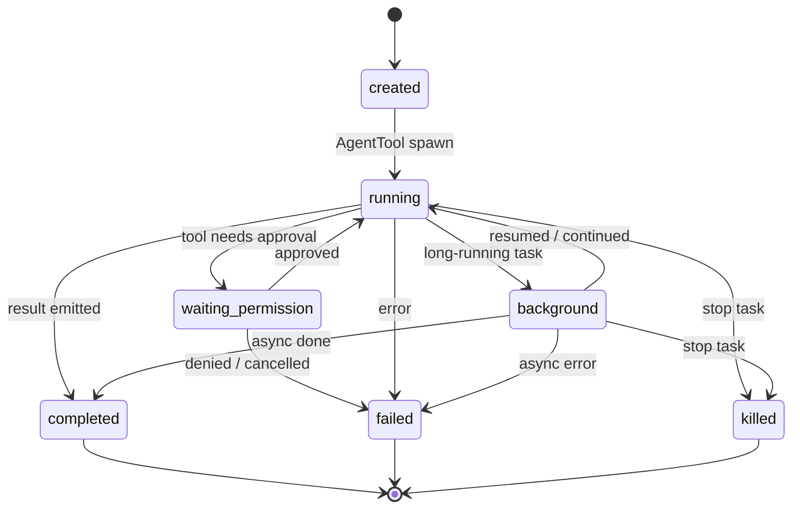

# 第 18 章 Agent 与多 Agent 设计

> 状态: 已写  
> 章节目标: 把“子 agent”设计成正式 runtime 能力，而不是 prompt 里的一句“你再扮演一个角色”。

[返回总览](/Users/magongli/Downloads/project/claude-code-sourcemap/docs/plans/2026-03-31-claude-code-runtime-reproduction/README.md)

---

## 18.0 本章结论

Claude Code 最值得复现的高级能力之一，就是它没有把 multi-agent 做成“一个 tool 调一下另一个 prompt”，而是做成了一套完整运行时：

- 有正式的 `AgentDefinition`
- 有正式的 `AgentTool`
- 有任务注册与生命周期
- 有 background / foreground 区分
- 有 worktree / remote isolation
- 有 coordinator mode
- 有 agent transcript、progress、notification 与 permission 处理

所以如果你想真正复现它，不要从“写几个 worker prompt”开始，而要从“定义 agent 作为一种任务执行单元”开始。



---

## 18.1 为什么 Agent 必须是一等抽象

很多项目做 multi-agent 时，常见路线是：

- 主模型生成一个“子任务 prompt”
- 再手动起一个模型调用
- 结果回来后拼回主对话

这条路短期能演示，但一旦项目变复杂就会暴露很多问题：

- 子 agent 的工具边界不清晰
- 权限弹窗没法正确路由
- 子 agent 的 transcript 无法独立持久化
- 背景运行与通知很难做
- 多个 worker 并发时很难管理生命周期

Claude Code 的做法恰恰相反：  
它先定义 agent 是什么，再把“起子 agent”实现成一个 tool。

也就是说：

- `agent` 是领域抽象
- `AgentTool` 只是触发器

这个顺序非常关键。复现时你也应该先把 agent runtime 建好，再写 `spawn agent` 的接口。

---

## 18.2 AgentDefinition 模型

`loadAgentsDir.ts` 暴露出的字段非常丰富，这恰好说明 agent 不是一个只有 prompt 的对象，而是“一个带运行策略的执行配置”。

### 18.2.1 AgentDefinition 至少包含什么

从源码可以整理出 agent definition 的核心字段：

- `agentType`
- `whenToUse`
- `tools`
- `disallowedTools`
- `skills`
- `mcpServers`
- `hooks`
- `model`
- `effort`
- `permissionMode`
- `maxTurns`
- `initialPrompt`
- `memory`
- `background`
- `isolation`
- `requiredMcpServers`
- `criticalSystemReminder_EXPERIMENTAL`
- `omitClaudeMd`

这已经远远超过“一个 system prompt 模板”。  
它本质上是“一个可调度的运行配置对象”。

### 18.2.2 AgentDefinition 的来源类型

源码把 agent 明确分成三大类：

- `BuiltInAgentDefinition`
- `CustomAgentDefinition`
- `PluginAgentDefinition`

并且通过 `source` 区分：

- `built-in`
- 用户/项目/策略设置来源
- `plugin`

这意味着 agent 体系不是某一处硬编码，而是一个统一入口，支持多种来源的 agent 注入。

### 18.2.3 Agent 的优先级合并

`getActiveAgentsFromList()` 先按来源分组，再按顺序把 agent 写入 map，后写入的覆盖先写入的。这里最重要的不是具体优先级，而是这个模式：

> 先收集所有 agent，再选出 active agent，而不是边扫描边立即生效。

这个模式能让你：

- 输出 `allAgents`
- 输出 `activeAgents`
- 输出冲突与覆盖关系
- 在 UI 里解释“哪个 agent 当前生效”

复现版一定要保留这层“全部候选”和“最终生效”的区分。

---

## 18.3 Agent 不是只有 Prompt，它还有能力边界

### 18.3.1 tools / disallowedTools

AgentDefinition 可以声明允许工具和禁止工具。这个设计特别重要，因为它让 agent 的职责可以被硬编码约束，而不是完全靠 prompt 自觉。

例如：

- reviewer agent 只读，不允许 edit/write/bash
- implementer agent 可以读写文件和执行 shell
- release agent 允许 git / CI / deployment 相关能力

### 18.3.2 requiredMcpServers

`filterAgentsByMcpRequirements()` 会先根据当前可用 MCP server 过滤 agent。也就是说，agent 的可见性不仅取决于静态定义，还取决于当前运行时能力是否满足前置条件。

这是成熟系统非常值得复用的点：

- agent availability 是动态的
- agent UI 不该展示永远不可用的 agent
- prompt 层不应被迫处理“你可以用某 agent，但其实环境不满足”

### 18.3.3 memory / hooks / initialPrompt

这些字段说明 agent 还能携带：

- 长期记忆作用域
- 启动时附加 hooks
- 首轮用户消息前置提示

所以 agent 更像：

`运行人格 + 能力边界 + 生命周期配置 + 可选状态`

而不是纯粹 prompt persona。

---

## 18.4 AgentTool 的定位

`AgentTool.tsx` 是一个非常重要的实现。它不是“直接自己跑完整逻辑”的巨型脚本，而是：

- 暴露 tool prompt
- 暴露 input/output schema
- 在 `call()` 里处理任务发起、权限模式、同步/异步分流
- 进一步委托给 `runAgent()`、task registry、remote task 等下层模块

这说明 `AgentTool` 的职责是“调度入口”，不是“把 agent 系统一股脑写在一个文件里”。

### 18.4.1 AgentTool 输入模型

从 schema 可见，公开输入包括：

- `description`
- `prompt`
- `subagent_type`
- `model`
- `run_in_background`
- `name`
- `team_name`
- `mode`
- `isolation`
- `cwd`

这几个字段很值得学习，因为它们覆盖了 agent 发起时真正需要决定的维度：

- 任务是什么
- 选哪个 agent 类型
- 运行在前台还是后台
- 权限模式是什么
- 是否需要隔离
- 是否需要覆盖 cwd

### 18.4.2 AgentTool 输出模型

AgentTool 并不只有“完成结果”一种返回。源码里至少有这些状态：

- `completed`
- `async_launched`
- `teammate_spawned`
- `remote_launched`

这背后的思想非常重要：

> “启动 agent”与“拿到 agent 最终结果”不是一回事。

如果你复现时把这两个阶段混成一个同步结果对象，就很难支持：

- 背景任务
- remote worker
- 协调者模式
- task continuation

---

## 18.5 AgentTool Prompt 是如何生成的

`AgentTool.prompt()` 会根据当前 runtime 环境动态生成工具提示，而不是把所有 agent 类型无脑暴露给模型。

它至少做了两层过滤：

1. 按 MCP requirements 过滤  
只有当前已连接的 MCP server 能满足要求的 agent 才会被展示

2. 按 permission deny rules 过滤  
被权限规则拒绝的 agent 不会出现在 prompt 中

这说明 Claude Code 的设计不是“先告诉模型所有能力，再让模型别用”，而是：

> 在工具被模型看到之前，就先做能力裁切。

这一点在复现时非常关键。要复现 Claude Code 的质感，你要尽量把非法能力从 prompt 层移除，而不是依赖后置拒绝。

---

## 18.6 runAgent 才是 Agent Runtime 的核心

真正的 agent 执行主循环在 `runAgent.ts`。它大致承担这些事：

- 继承和裁切父级上下文
- 构建 agent 的系统 prompt
- 解析 agent 自己的 tools / skills / hooks / MCP
- 初始化 transcript 子目录
- 初始化 file state cache
- 执行 query loop
- 记录可回放消息
- 做清理与收尾

也就是说，`runAgent()` 更接近“一个可嵌套 query engine 实例化器”。

### 18.6.1 Agent 也会重新组装自己的上下文

它不是简单继承父 agent 所有 prompt。相反，它会重新计算：

- `DEFAULT_AGENT_PROMPT`
- `getSystemContext()`
- `getUserContext()`
- `enhanceSystemPromptWithEnvDetails()`
- `getAgentModel()`

这说明每个 agent 都应该被视作一个相对独立的 query session，而不只是“父 agent 多了一次函数调用”。

### 18.6.2 Agent 也有自己的 MCP 生命周期

`initializeAgentMcpServers()` 是这章最值得注意的设计之一。它说明 agent 可以声明自己专属的 MCP servers，并且这些 server：

- 可以引用现有命名 server
- 也可以通过 inline config 临时定义
- 会在 agent 启动时连接
- 会在 agent 结束时清理

而且这里还有策略判断：

- 当 MCP 被限制为 plugin-only customization 时
- 用户控制来源的 agent frontmatter MCP 会被跳过
- admin-trusted agent 仍可加载

这说明 agent 不是一个“只关心 prompt 的单元”，而是能携带自己资源面配置的执行单元。

### 18.6.3 Agent 也有自己的 transcript 和缓存

`runAgent.ts` 里会：

- 设置 agent transcript 子目录
- 记录 sidechain transcript
- 写 agent metadata
- 克隆或初始化 file state cache

这说明每个子 agent 都不是 ephemeral 的“纯计算”，而是可以被观测、被回放、被诊断的任务实体。

---

## 18.7 Sync Agent 与 Background Agent

### 18.7.1 为什么要区分同步和异步

多 agent 系统一旦进入真实工程使用，就会出现两类任务：

- 很短、需要立刻拿结果的任务
- 很长、适合后台跑的任务

AgentTool 已经把这层做成正式能力：

- `run_in_background`
- env/gate 控制 background 功能
- 运行一定时间后自动建议或切换后台

源码里还有一个自动后台阈值：

- 如果环境变量或 gate 开启，超过 `120000ms` 可自动后台化

这说明 background 不是附属体验，而是 runtime 为了长任务可用性做的正式设计。

### 18.7.2 Background Agent 需要哪些配套

只把模型调用放到异步线程并不够，至少还要有：

- task registry
- progress tracker
- output file
- notification queue
- completion / failure / kill 状态

源码里这些能力散落在 `LocalAgentTask` 与相关工具里，AgentTool 只是把它们接起来。

复现版建议你也用 `Task` 抽象统一表示 background job，而不是给 agent 单独做一套。

---

## 18.8 Task 生命周期

从 AgentTool 导入的那些 task 方法可以大致还原任务生命周期：

- 创建 task
- 注册前台或后台状态
- 更新 progress
- 生成 activity description
- 完成 task
- 失败 task
- kill task
- 发送通知

这意味着在 Claude Code 风格系统里，agent 已经被提升为“任务系统”里的正式对象。

### 18.8.1 推荐的 Task 状态机

复现版可以直接设计成：

```ts
type TaskStatus =
  | 'created'
  | 'running'
  | 'waiting_permission'
  | 'background'
  | 'completed'
  | 'failed'
  | 'killed'
```

再额外维护：

- `progressText`
- `tokenUsage`
- `toolUseCount`
- `durationMs`
- `outputPath`
- `sessionId`
- `agentId`

### 18.8.2 Progress 为什么必须结构化

`AgentTool` 还会把它自己的 progress 以及子 agent 内 shell progress 一起转发给 SDK。这个设计很成熟，因为真实用户并不只关心“最后结果”，还关心：

- 现在在做什么
- 卡在哪一步
- 是否还活着
- 是否在跑 bash

所以复现时不要把 progress 当成 console.log。应当把它建成统一事件类型。

---

## 18.9 Coordinator Mode 的真正含义

很多人会把 coordinator 理解成“再写一个总控 prompt”。这太浅了。

`coordinatorMode.ts` 显示，coordinator mode 至少改变了这些东西：

- 系统 prompt
- worker 可用工具上下文
- agent tool 使用方式
- worker 结果回传协议
- 会话恢复时的 mode 对齐逻辑

### 18.9.1 coordinator 的职责不是干活，而是分工

`getCoordinatorSystemPrompt()` 里定义得非常清楚：coordinator 负责

- 理解用户目标
- 启动 worker
- 综合研究结果
- 给出具体实现 prompt
- 与用户沟通

worker 则负责：

- research
- implementation
- verification

这是一种非常典型也非常实用的分层：  
把“理解与编排”留给 coordinator，把“执行与验证”留给 worker。

### 18.9.2 worker result 不是 assistant message，而是通知消息

coordinator prompt 中甚至定义了 `<task-notification>` XML 的用户态消息格式。这个设计的本质是：

- worker result 会回到 coordinator 会话
- 但它不是正常用户，也不是独立 assistant
- 它是一种内部通知信号

这很值得复现。因为一旦你把 worker 输出直接混进普通 assistant transcript，就很难区分：

- 用户说的话
- 协调者说的话
- worker 的结果消息

### 18.9.3 会话恢复也要带上 mode

`matchSessionMode()` 会根据 session 保存的 mode 调整当前环境，让 resumed session 恢复到正确的 normal/coordinator 模式。

这说明 mode 不是 UI 开关，而是会话语义的一部分。复现时也要把 mode 存进 session metadata。

---

## 18.10 Worker 能力裁切

Claude Code 风格 multi-agent 的另一个关键点，是 worker 的能力不会与主 agent 完全一样。

`getCoordinatorUserContext()` 会明确告诉 coordinator：

- worker 拥有哪些标准工具
- worker 能使用哪些 MCP tool
- scratchpad 在哪里

而 coordinator prompt 也要求：

- 不要把简单汇报工作委托给 worker
- 不要让一个 worker 监视另一个 worker
- 尽量并行启动相互独立的研究任务

这说明 worker 不是“复制主 agent 再套个名字”，而是有被刻意缩减和引导过的能力面。

复现时一定要保留这种差异化设计，否则多 agent 很快会变成：

- 每个 agent 都能力过强
- prompt 互相抢活
- 权限和工具使用不可控

---

## 18.11 Isolation: worktree / remote / cwd

### 18.11.1 worktree isolation

AgentTool schema 里支持 `isolation: 'worktree'`。这说明子 agent 可以在临时 git worktree 里执行，而不是直接污染主工作区。

这层能力的价值非常大：

- 多个实现任务可以并行写代码
- 主工作树不容易被中间态破坏
- 便于做 agent 级别的提交、比较和回收

### 18.11.2 remote isolation

源码里还可以看到 ant-only 的 `remote` 隔离模式，以及 RemoteAgentTask 相关逻辑。这说明某些 agent 不只在本地隔离，还可以被投递到远端运行环境。

这一步对复现版不是 MVP 必需，但设计时应预留 `isolation` 为枚举，而不要把它写死成布尔值。

### 18.11.3 cwd override

`cwd` 是一个很容易忽略但很实用的维度。它允许 agent 在不同根目录工作，而不是被父会话工作目录绑死。

如果你的复现工程未来要支持：

- monorepo 子项目
- 临时目录分析
- 多仓协作

那么 `cwd` 级覆盖非常值得保留。

---

## 18.12 Agent 间消息与通知模型

### 18.12.1 主通信不是 agent 对话，而是任务消息

从 SendMessage、TaskStop、notification XML、progress event 这些设计可以看出，agent 之间并不是像聊天室一样自由对话，而是：

- 通过工具调用发起
- 通过任务通知回传状态
- 通过 continuation 消息继续已有 worker

这是很强的工程化选择。它牺牲了一点“自由协作感”，换来：

- 明确的任务边界
- 明确的所有权
- 明确的恢复路径
- 明确的日志与 transcript

### 18.12.2 continuation 比重新 spawn 更重要

coordinator prompt 明确强调：当 worker 已经有上下文时，优先 `SendMessage` 继续，而不是重启一个新 worker。

这背后的核心思想是：

- worker 上下文是有价值的
- 任务不是 stateless RPC
- continuation 可以减少 prompt 成本和理解损耗

复现版如果只支持 `spawn`，不支持 `continue existing agent`，多 agent 的体验会差很多。

---

## 18.13 复现时应该怎么落地

### 18.13.1 MVP

只做这些就够：

- `AgentDefinition`
- `AgentTool`
- `runAgent()`
- 同步子 agent
- 子 agent transcript
- 子 agent 工具裁切

### 18.13.2 增强版

再加：

- background task
- progress tracker
- output file
- continuation
- basic coordinator mode

### 18.13.3 高级版

最后再做：

- worktree isolation
- remote isolation
- agent-specific MCP
- memory snapshot
- worker scratchpad
- full task notification protocol

---

## 18.14 复现工程的建议接口

如果你要真正开工，我建议先定这些接口：

```ts
type AgentDefinition = {
  agentType: string
  whenToUse: string
  getSystemPrompt: () => string
  tools?: string[]
  disallowedTools?: string[]
  skills?: string[]
  mcpServers?: AgentMcpServerSpec[]
  permissionMode?: PermissionMode
  maxTurns?: number
  background?: boolean
  isolation?: 'none' | 'worktree' | 'remote'
  initialPrompt?: string
}

type AgentRunRequest = {
  agent: AgentDefinition
  promptMessages: Message[]
  parentSessionId: string
  isAsync: boolean
  cwd?: string
}

type AgentRunResult =
  | { status: 'completed'; finalText: string }
  | { status: 'async_launched'; taskId: string; outputFile: string }
```

然后把 task 层和 query 层分开：

- `runAgent()` 负责 agent query 生命周期
- `AgentTaskManager` 负责后台任务
- `AgentTool` 负责把模型调用映射到这两层

---

## 18.15 你最应该借用的核心思想

这一章最值得抄走的是下面 5 点：

1. agent 先是运行时对象，后才是 tool 可调用对象。
2. multi-agent 的关键不是 prompt 花样，而是任务生命周期管理。
3. coordinator mode 不是多一段提示词，而是整套运行语义的切换。
4. worker 必须有能力裁切、上下文隔离和 continuation 机制。
5. 任何子 agent 都应可观测、可回放、可中断、可恢复。

把这 5 点做对，你复现出来的就不是“能多开几个模型请求”，而是真正像 Claude Code 那样的 agent runtime。

## 18.16 本章对复现工程的直接指导

multi-agent 很容易变成“为了高级而高级”的复杂度黑洞。复现时建议严格按增量路线推进。

### 18.16.1 第一版先做单 agent runtime，不做 coordinator

顺序建议是：

1. `AgentDefinition`
2. `runAgent()`
3. `AgentTaskManager`
4. `AgentTool`
5. background task
6. coordinator mode

这样你能先验证“agent 作为运行时对象”这个核心抽象，而不是一开始就做一套分工系统。

### 18.16.2 task 必须早于 worker orchestration

不要先做“能调用别的 agent”，后面再补 task。  
Claude Code 风格的关键不是 spawn 了几个 worker，而是：

- 是否能追踪
- 是否能恢复
- 是否能中断
- 是否能回放

这些都建立在正式的 `Task` 生命周期之上。

### 18.16.3 同步 agent 和后台 agent 要明确分开

最小也要保留两个结果分支：

- 立即完成
- 异步启动并返回 task handle

如果把后台 agent 伪装成普通 tool 返回值，后面 UI、remote、diagnostics、resume 都会被迫绕一层兼容逻辑。

### 18.16.4 worker 能力裁切第一版就要做

哪怕是最小版，也建议保留：

- `tools`
- `disallowedTools`
- `permissionMode`
- `isolation`

否则子 agent 很快就会继承父级全部能力，最后你很难解释为什么一个“辅助 agent”能直接改工作区、发网络请求或无限递归再开 agent。

### 18.16.5 第一版推荐目录

```text
agents/
  definitions/
  runtime/
  tasks/
  tools/
  coordinator/
```

这一章真正帮你避免的，是把 agent 做成“特殊工具函数集合”。一旦走到那条路，后面几乎一定要返工成正式 runtime。
