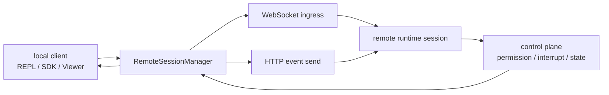
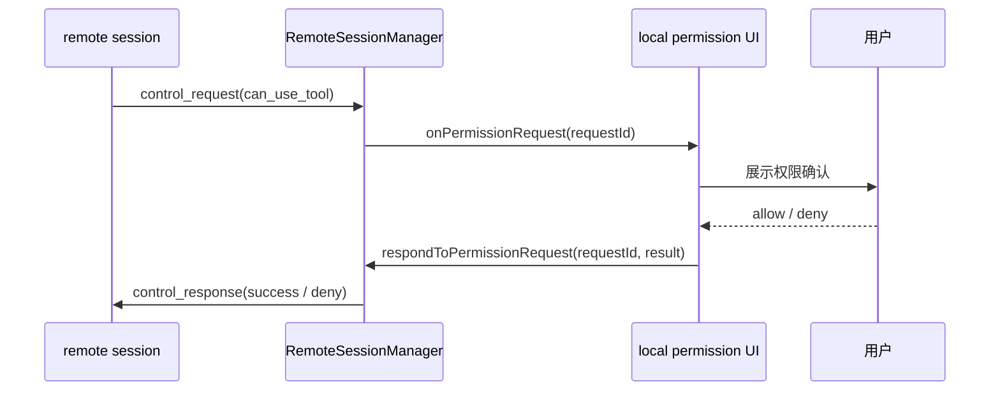

# 第 19 章 Remote / Bridge 设计

> 状态: 已写  
> 章节目标: 把“远程会话”设计成同一 runtime 的 transport/control 平面，而不是另一套产品。

[返回总览](/Users/magongli/Downloads/project/claude-code-sourcemap/docs/plans/2026-03-31-claude-code-runtime-reproduction/README.md)

---

## 19.0 本章结论

Claude Code 风格系统里的 remote / bridge，最值得学习的地方是：

- 它没有重新发明一套 agent 语义
- 它复用同一套消息模型、权限模型、任务模型
- 它只是把本地 REPL 与远程 session 之间的 transport 与 control plane 系统化了

换句话说，remote 不是“另一个 Claude Code”，而是“Claude Code runtime 的远程承载层”。

这点对复现工程非常重要。正确路线不是先做“网页版 agent”，而是先把：

- 会话消息
- 工具权限请求
- 中断信号
- 状态同步

抽象成可以跨进程、跨设备传输的协议。



---

## 19.1 本地会话与远程会话的关系

### 19.1.1 同一逻辑，不同承载

远程会话不是新逻辑，而是同一会话语义被迁移到了远端执行环境。  
本地端主要承担这些职责：

- 显示消息
- 接收用户输入
- 处理远端发回的控制请求
- 在必要时作出权限决策

远端主要承担：

- 持有实际 session
- 跑模型和 query loop
- 发回流式事件
- 请求工具权限

所以这套设计本质上是：

`local UI/client <-> remote runtime session`

而不是：

`local UI <-> remote mirror of UI`

### 19.1.2 remote 的边界

如果你复现时也想做 remote，建议把边界定成：

- 远端负责 runtime
- 本地负责 terminal/SDK 适配
- 双方通过统一 SDK message 与 control message 通信

不要让本地和远端各自持有一份业务规则，否则很快会产生分叉。

---

## 19.2 RemoteSessionManager 的职责

`RemoteSessionManager.ts` 是理解 remote 模型的很好入口。它的职责很纯粹：

- 管理 WebSocket 订阅，接收入站消息
- 通过 HTTP POST 发送用户消息
- 管理 permission request/response 生命周期
- 通知上层连接状态变化

这说明 remote manager 不是 query engine，也不是 UI store。它是一个很标准的“会话连接适配器”。

### 19.2.1 入站与出站分离

源码里：

- 入站走 `SessionsWebSocket`
- 出站走 `sendEventToRemoteSession()`

这个模式很适合复现：

- 订阅型消息通道负责服务端事件推送
- 请求型消息通道负责发送用户输入或控制动作

这样做的好处是：

- 实现简单
- 调试方便
- 更贴合“事件流 + 用户动作”的语义

### 19.2.2 RemoteSessionManager 不直接做 UI 决策

它只通过 callbacks 向上抛：

- `onMessage`
- `onPermissionRequest`
- `onPermissionCancelled`
- `onConnected`
- `onDisconnected`
- `onReconnecting`
- `onError`

这表明 remote 层被严格限制在 transport 边界内。  
复现时也建议保持这种纯度，不要在 manager 内部弹 UI 或改业务状态。

---

## 19.3 远程消息模型

### 19.3.1 业务消息与控制消息分流

`RemoteSessionManager` 里首先做的就是区分：

- `SDKMessage`
- `SDKControlRequest`
- `SDKControlResponse`
- `SDKControlCancelRequest`

这非常关键。因为远程会话里至少有两种完全不同的消息：

1. 正常业务流  
assistant message、tool progress、system 事件等

2. 控制流  
权限请求、中断、取消、参数变更等

如果把它们混在同一个 message union 里不做分流，UI 和 runtime 都会很乱。

### 19.3.2 control request 的核心价值

在本地运行时，权限弹窗是进程内调用；但远程运行时，权限必须跨连接请求。这就是 control plane 的核心价值。

最典型的例子就是：

- 远端 session 想用某个工具
- 但权限决策必须由本地用户确认
- 所以远端发 `control_request`
- 本地展示确认 UI
- 本地再通过 `control_response` 回写结果

这说明 remote 的难点并不在“远端也能聊天”，而在“远端也能参与受控工具执行”。

---

## 19.4 Permission Relay 设计

### 19.4.1 为什么权限中继是 remote 的核心

一个没有权限中继的 remote agent，最多只是“把模型放到远程跑”；但 Claude Code 风格系统要求远端还能安全地执行工具，所以 permission relay 是第一优先级。



`RemoteSessionManager` 中已经体现出一个简化过的远程权限结果模型：

```ts
type RemotePermissionResponse =
  | { behavior: 'allow'; updatedInput: Record<string, unknown> }
  | { behavior: 'deny'; message: string }
```

这里保留了两个非常关键的能力：

- allow
- deny
- allow 时还能带 `updatedInput`

最后这个 `updatedInput` 很重要，因为用户批准时有时不只是“是/否”，还可能修改参数，比如：

- 缩小命令范围
- 调整文件路径
- 修正危险输入

### 19.4.2 pending request 管理

manager 内部会用 `pendingPermissionRequests` 记录尚未完成的请求。这个设计不可省，因为远程权限流程天然存在异步性：

- 请求发来
- 用户还没回答
- 期间连接可能重连
- 服务器甚至可能取消该请求

所以你必须给每个权限请求分配 `request_id`，并维护 pending map。

### 19.4.3 cancel request

`control_cancel_request` 是一个很成熟的设计。它说明服务端可能在等待权限答案期间改变状态，于是主动取消原请求。

复现时很多人只做 request/response，不做 cancel。但一旦：

- 工具执行已超时
- agent 被终止
- 任务被切换

本地 UI 就会残留一个无效弹窗。  
所以 cancel 机制很值得直接照抄。

---

## 19.5 Viewer Mode

`RemoteSessionConfig` 里有一个很有代表性的开关：`viewerOnly`。

它的含义不是“只读 UI”这么简单，而是成体系地调整 remote 行为：

- `Ctrl+C / Escape` 不再向远端发送 interrupt
- 60 秒 reconnect timeout 被禁用
- session title 不再更新

这说明 viewer mode 不是另一个产品，而是：

> 在同一 remote session 协议上的一个更弱权限客户端角色。

这非常值得复现，因为它自然支持：

- 主控端
- 陪同观察端
- assistant viewer
- 只读审计端

如果你将来要做“手机上看进度”“网页观测后台 agent”，viewerOnly 这种模式会很有用。

---

## 19.6 Env-less Bridge Core 的设计思想

`remoteBridgeCore.ts` 的文档注释非常有信息量。它说明新 bridge 路线的核心目标是：

> 直接连到 session-ingress 层，去掉中间 Environments API 的工作分发层。

这意味着 remote/bridge 不是简单“多一个 websocket”，而是一整套更轻的会话桥接协议。

### 19.6.1 初始化主链路

从注释与实现可以还原出大致链路：

1. `POST /v1/code/sessions`  
创建 session，拿到 `session.id`

2. `POST /v1/code/sessions/{id}/bridge`  
拿到 `worker_jwt`、`expires_in`、`api_base_url`、`worker_epoch`

3. `createV2ReplTransport(...)`  
建立 SSE + CCRClient transport

4. `createTokenRefreshScheduler(...)`  
在 token 过期前主动刷新 bridge credentials

5. 若 SSE 发生 401  
使用新的 bridge credentials 重建 transport

这个流程很值得学习，因为它把“建立远程工作会话”拆成了清晰的两个阶段：

- session creation
- transport authorization

不要把它们耦合成一个神秘的 `connectRemote()`。

### 19.6.2 epoch 的作用

注释里特别强调，每次 `/bridge` 调用都会 bump `epoch`。这说明远程 transport 不是只有 JWT 需要刷新，session transport 自己也有版本语义。

复现时哪怕不叫 epoch，也建议保留一个“transport generation/version”概念，用来处理：

- 老连接作废
- 新连接接管
- 心跳或 ACK 失效

---

## 19.7 连续性、去重与有序性

真正的 remote 系统难点，不是“连上”，而是“在掉线、重连、重放时还能保持会话正确”。

### 19.7.1 FlushGate

`FlushGate` 的设计很成熟。它的目标是：

- 初始历史 flush 期间
- 暂存新的 live writes
- 确保服务端最终按 `[history..., live...]` 的顺序接收

这说明远程桥接层非常在意消息顺序。  
如果你复现时忽略这一层，恢复连接后很容易出现：

- 上下文乱序
- 首批历史晚于新输入
- 模型看到错误时间线

### 19.7.2 UUID 去重

源码用 `BoundedUUIDSet` 维护：

- `recentPostedUUIDs`
- `initialMessageUUIDs`
- `recentInboundUUIDs`

这说明至少存在三类重复风险：

- 自己发出的消息被服务端 echo 回来
- 初始历史在重连时被重放
- 入站流在连接切换时重复投递

复现时，消息去重一定不要靠“文本相同就算重复”，要靠稳定的 message UUID。

### 19.7.3 session continuity

bridge 核心里 session ID 是稳定的，transport 可以被重建。这个设计非常好：

- session continuity 不依赖某个 socket
- reconnect 不等于新会话
- token refresh 不等于上下文丢失

所以复现时建议把：

- `session identity`
- `transport instance`

拆开管理。

---

## 19.8 reconnect / token refresh / auth recovery

### 19.8.1 proactive refresh

Bridge core 会在 token 到期前通过 scheduler 主动刷新 credentials。这个设计比“等到断了再补救”明显更平滑。

### 19.8.2 auth 401 recovery

同时它也支持在收到 401 后重建 transport。这个兜底非常重要，因为远程环境里主动刷新永远不可能覆盖所有边角情况。

### 19.8.3 状态变化回调

Bridge 参数里还有：

- `onStateChange`
- `onInboundMessage`
- `onPermissionResponse`
- `onInterrupt`
- `onSetModel`
- `onSetMaxThinkingTokens`
- `onSetPermissionMode`

这说明 bridge 不只是传文本消息，还能同步 session 控制面变化。

如果你复现时只同步聊天内容，而不同步模型切换、权限模式、中断事件，remote 就只完成了 30%。

---

## 19.9 与 REPL / SDK 的集成边界

### 19.9.1 Remote 不应拥有独立业务模型

bridge 参数里要求调用方提供：

- `toSDKMessages`
- `initialMessages`
- `initialHistoryCap`

这说明 remote 层并不定义自己的消息格式，而是依赖调用方把内部 `Message[]` 投影为 `SDKMessage[]`。

这非常值得复现。做法应该是：

- runtime 内部有统一 Message 模型
- remote 层只定义传输协议格式
- 映射器负责两边转换

### 19.9.2 Remote 与本地 REPL 是两个入口，不是两个内核

用户最终看到的可能是：

- 本地终端 REPL
- SDK 客户端
- assistant viewer

但它们共享的应该还是：

- session
- message model
- permission model
- task model

这也是 Claude Code 风格架构的一条主线：  
多入口，共内核。

---

## 19.10 复现时怎么分阶段做

### 19.10.1 第一阶段

先别做 full remote，只做：

- 本地 runtime
- WebSocket/SSE 入站消息
- HTTP 出站消息
- 基础 reconnect

### 19.10.2 第二阶段

再加：

- control request / response
- permission relay
- interrupt relay
- viewerOnly

### 19.10.3 第三阶段

最后再做：

- session creation API
- bridge credential refresh
- 401 recovery
- initial history flush
- UUID dedup
- transport rebuild with continuity

---

## 19.11 复现工程建议接口

```ts
type RemoteSessionManager = {
  connect(): void
  disconnect(): void
  sendMessage(content: RemoteMessageContent, opts?: { uuid?: string }): Promise<boolean>
  respondToPermissionRequest(requestId: string, result: RemotePermissionResponse): void
}

type BridgeHandle = {
  writeMessages(messages: Message[]): Promise<void>
  interrupt(): void
  close(): Promise<void>
}
```

同时定义清晰的控制消息：

```ts
type ControlRequest =
  | { subtype: 'can_use_tool'; requestId: string; toolName: string }
  | { subtype: 'interrupt' }
  | { subtype: 'set_permission_mode'; mode: PermissionMode }
```

---

## 19.12 你最应该借用的核心思想

这一章最值得你复用的是下面 4 点：

1. remote 不是另一套 agent 逻辑，而是同一 runtime 的 transport/control 平面。
2. 远程系统最重要的是权限中继、状态同步和会话连续性，不是“能联网聊天”。
3. session identity 必须与 transport lifecycle 解耦。
4. 去重、排序、flush、refresh、cancel 这些看起来“偏基础设施”的细节，决定了 remote 能不能真正稳定可用。

把这 4 点做对，你的远程层才会是一个可靠 runtime bridge，而不是脆弱的演示通道。

## 19.13 本章对复现工程的直接指导

remote 看起来像“后面再接一个传输层”，但实际上它很容易把权限、状态和一致性全部搅乱。复现时建议非常克制地做。

### 19.13.1 第一阶段只做单向可观测，不做全量双向控制

最小顺序建议：

1. 会话消息下发
2. 状态事件同步
3. reconnect
4. interrupt relay
5. permission relay
6. session continuity

这样你能先确认 remote 是否真的只是 transport/control plane，而不是偷偷长成另一套业务内核。

### 19.13.2 RemoteSessionManager 只做桥接，不做业务判断

第一版就把职责压死：

- 连接管理
- 消息发送
- 控制消息收发
- 断连恢复

不要让它决定 query 行为、工具可见性或 UI 状态，否则 remote 层会很快和 runtime core 纠缠到一起。

### 19.13.3 permission relay 必须和本地 ask 共享同一语义

远程权限不是新权限系统。  
它只是 `ask` 这条路径换了一个宿主。

所以：

- request id
- pending request
- cancel
- 超时
- 最终 allow/deny 结果

都应该和本地权限主链对齐。

### 19.13.4 连续性比 transport 花样更重要

第一版最值钱的能力不是支持多少协议，而是：

- session id 不变
- 消息不重放
- flush 顺序稳定
- reconnect 后能续上

如果这些没做好，再炫的 transport 也只是演示层。

### 19.13.5 第一版推荐目录

```text
remote/
  session-manager/
  transport/
  control-plane/
  continuity/
  relay/
```

这一章真正帮你规避的，是把 remote 误做成“又一套 REPL”。正确答案始终是：它是同一 runtime 的桥，不是另一个 runtime。
