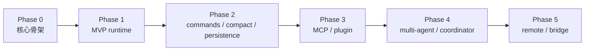

# 第 23 章 实现路线图

> 状态: 已写  
> 章节目标: 把前面的设计说明收敛成一条可执行的工程落地路径。

[返回总览](/Users/magongli/Downloads/project/claude-code-sourcemap/docs/plans/2026-03-31-claude-code-runtime-reproduction/README.md)

---

## 23.0 本章结论

如果你的目标是复现 Claude Code 风格 runtime，最重要的工程策略不是“功能尽快堆满”，而是“抽象先稳住，能力分阶段加上去”。

推荐路线一定是：

1. 先完成统一 runtime 内核
2. 再补 command/skill/compact/persistence
3. 再接 MCP/plugin
4. 再上 multi-agent
5. 最后做 remote/bridge

不要反过来。  
如果在 query engine、tool orchestration、permission、session 这些内核还不稳定时，就急着做 marketplace 或 remote，后面会不断返工。



---

## 23.1 先设定整体原则

在开始 Phase 拆分前，建议你先定下这 6 条工程原则：

### 23.1.1 一切共享同一内核

REPL、headless、SDK、remote 入口都必须复用同一个 query/runtime 内核。

### 23.1.2 先抽象，再接 UI

不要让终端 UI 绑架运行时结构。先做无 UI 闭环。

### 23.1.3 所有高级能力都挂在稳定抽象上

高级能力只能建立在：

- `Message`
- `Command`
- `Tool`
- `ToolUseContext`
- `AppState`
- `Session`
- `Task`

这些抽象稳定之后再添加。

### 23.1.4 每个阶段都必须可演示、可验证

阶段结束标准不能是“代码写了很多”，而要是：

- 能跑
- 能测试
- 能解释

### 23.1.5 每个阶段都保留未来兼容点

哪怕暂时不做 marketplace、remote，也要把接口留成可扩展形态。

### 23.1.6 不要一开始追求 1:1 还原

优先复现思想与机制，不要先被 bundle 里的 feature gate 和边角功能拖死。

---

## 23.2 Phase 0: 核心骨架

### 23.2.1 目标

先搭出最小的“可运行 agent runtime 骨架”。

### 23.2.2 必做内容

- CLI 入口
- 基础配置加载
- `Message` 类型
- `Tool` 类型
- `ToolUseContext`
- `AppState`
- 简单 session 目录
- 假模型 / 适配器接口

### 23.2.3 暂时不要做

- 复杂 UI
- MCP
- plugin
- multi-agent
- remote

### 23.2.4 交付物

- 可以通过 CLI 启动
- 可以接收一条用户输入
- 可以调用一个 fake model
- 可以生成一条 assistant 响应
- 可以把 transcript 落盘

### 23.2.5 验收标准

- 项目目录结构清晰
- 核心类型不再频繁重命名
- 最小 query path 可跑通
- 至少有 1 套集成测试覆盖最小闭环

---

## 23.3 Phase 1: MVP Runtime

### 23.3.1 目标

把 runtime 从“可运行骨架”推进到“真正能用的基础版终端 agent”。

### 23.3.2 必做内容

- `QueryEngine`
- streaming 输出
- `Read / Edit / Write / Bash` 基础工具
- permission gate
- REPL 模式
- headless `--print` 模式
- session transcript 持久化

### 23.3.3 关键边界

这一阶段最重要的是做出“单轮 agent 闭环”：

`user input -> query -> tool_use -> tool_result -> assistant response`

### 23.3.4 交付物

- 可交互 REPL
- 可脚本化 headless 模式
- 基础工具可用
- 权限确认可用
- transcript 可 resume

### 23.3.5 验收标准

- 最小代码修改任务可完成
- 权限流程能正确拦截写操作与 shell
- 至少 1 个 resume 场景通过
- query profiler / startup profiler 初版可用

---

## 23.4 Phase 2: Commands / Skills / Compact / Persistence

### 23.4.1 目标

让系统从“能回答”进化到“能长期对话、能被控制、能压缩上下文”。

### 23.4.2 必做内容

- slash command 系统
- markdown/frontmatter skill loader
- system prompt 合成策略
- token 估算
- auto compact
- compact result 回注
- session metadata / resume / fork

### 23.4.3 为什么这一阶段很关键

因为这一步决定系统是否具备“真实可持续对话能力”。  
没有 compact 和 persistence，agent 在真实使用里会很快崩。

### 23.4.4 交付物

- `/help`、`/compact`、`/plan` 这类基础命令
- skill 可被加载并参与 prompt
- 自动压缩长会话
- resume/fork 基础可用

### 23.4.5 验收标准

- 长会话 20-50 turn 不崩
- compact 后关键上下文仍可恢复
- command/skill 可独立测试
- transcript/replay 测试开始成形

---

## 23.5 Phase 3: MCP / Plugin

### 23.5.1 目标

把 runtime 从“内建能力系统”扩展到“可接外部协议、可装扩展包的系统”。

### 23.5.2 必做内容

- MCP config merge
- MCP client manager
- MCP tool/resource/prompt 投影
- plugin manifest
- plugin loader
- plugin command / agent / hook / MCP 贡献注册

### 23.5.3 实现顺序建议

先做 MCP，再做 plugin。原因是：

- plugin 只是扩展发行层
- MCP 是更底层的能力接入层

如果 MCP 抽象还不稳定，plugin 里关于 MCP 的贡献面也会一起摇晃。

### 23.5.4 交付物

- 可加载本地 MCP server
- MCP tool 能出现在工具池
- 本地 plugin 目录可被装载
- plugin 命令/agent 能进入注册中心

### 23.5.5 验收标准

- 至少 1 个 mock MCP server 集成测试通过
- 至少 1 个 session-only plugin 能完整装载
- 严格权限/来源策略仍然有效

---

## 23.6 Phase 4: Multi-Agent / Coordinator

### 23.6.1 目标

把 agent 从单体问答器提升为任务协作系统。

### 23.6.2 必做内容

- `AgentDefinition`
- `AgentTool`
- `runAgent()`
- task registry
- background task
- progress event
- coordinator mode
- continuation / stop
- worktree isolation

### 23.6.3 这一阶段的难点

不是 prompt，而是生命周期：

- 谁负责什么
- 任务如何继续
- 结果如何通知
- transcript 如何拆分
- 权限如何传递

### 23.6.4 交付物

- 子 agent 可同步运行
- background task 可异步运行
- coordinator 可分发研究与实现任务
- task notification 可回到主会话

### 23.6.5 验收标准

- 至少可稳定并发 2-3 个 worker
- continuation 与 stop 能正常工作
- worktree 模式能隔离修改
- agent transcript 与 progress 可回放

---

## 23.7 Phase 5: Remote / Bridge

### 23.7.1 目标

把 runtime 从本地终端内核扩展为跨端/远程可访问系统。

### 23.7.2 必做内容

- remote session manager
- control request/response
- permission relay
- reconnect / token refresh
- session continuity
- viewer mode
- bridge transport abstraction

### 23.7.3 为什么放最后

因为 remote 会把之前所有复杂度都放大：

- session state
- permission
- task notification
- message ordering
- transcript continuity

前面内核不稳，remote 基本写不成。

### 23.7.4 交付物

- 基础 remote session 可连接
- 消息可双向传递
- 权限可中继
- reconnect 可恢复
- viewer mode 可只读观察

### 23.7.5 验收标准

- 断线重连不丢上下文
- 旧 permission request 不乱配对
- 初始 history flush 与 live message 顺序正确
- viewer 模式不会错误发送控制行为

---

## 23.8 横向基础设施工作流

这些东西不要等最后再补，要横跨所有 phase 同步推进：

### 23.8.1 测试

每个阶段都要补对应的 unit/integration/replay/e2e。

### 23.8.2 观测

startup/query profiler、diagnostics、debug logging 从早期就插入。

### 23.8.3 安全

permission、path validation、secret hygiene、source policy 必须全程跟进。

### 23.8.4 文档

实现过程中持续把运行链和接口记录下来，否则后期会忘。

---

## 23.9 推荐的代码组织方式

为了支持上述阶段推进，我建议目录从一开始就按下面方式分层：

```text
src/
  bootstrap/
  runtime/
  query/
  tools/
  commands/
  context/
  session/
  permissions/
  compact/
  mcp/
  plugins/
  agents/
  remote/
  telemetry/
  ui/
```

这样每个阶段都有比较自然的落点，而不会把所有逻辑堆在 `main.tsx` 和几个 utils 文件里。

---

## 23.10 每阶段的停机线

为了避免项目失控，建议每个阶段都有“先不继续加功能”的停机线：

### 23.10.1 Phase 1 停机线

如果基础 query loop、permission、transcript 还不稳，不进入 Phase 2。

### 23.10.2 Phase 2 停机线

如果 compact / resume / command registry 还经常回归，不进入 Phase 3。

### 23.10.3 Phase 3 停机线

如果 MCP/plugin 装载还经常影响核心 query path，不进入 Phase 4。

### 23.10.4 Phase 4 停机线

如果 task lifecycle、progress、continuation 还不稳定，不进入 Phase 5。

这会让路线图更慢一点，但会极大减少返工。

---

## 23.11 最后的建议

如果你是一个人复现，我强烈建议：

- 先做到 Phase 2.5 再考虑 multi-agent
- 不要在 Phase 1 就追终端 UI 细节
- 先把无 UI、可测试内核做稳

如果你是两三个人协作，可以按下面方式并行：

- 一人做 query/tool/session
- 一人做 command/compact/persistence
- 一人做 MCP/plugin 或 REPL UI

但 multi-agent 和 remote 最好仍在内核稳定后再推进。

---

## 23.12 你最应该借用的核心思想

这一章最值得你复用的是 4 点：

1. 先统一 runtime，再叠高级能力。
2. 每个 phase 都要有明确交付物与停机线。
3. multi-agent 和 remote 是建立在稳定内核上的放大器，不是起点。
4. 观测、安全、测试必须与功能开发同步推进。

照这个路线走，你更有机会把这个复现工程做成“可长期进化的产品内核”，而不是一堆功能拼接品。
